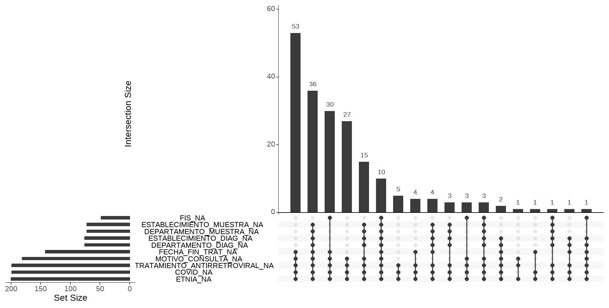
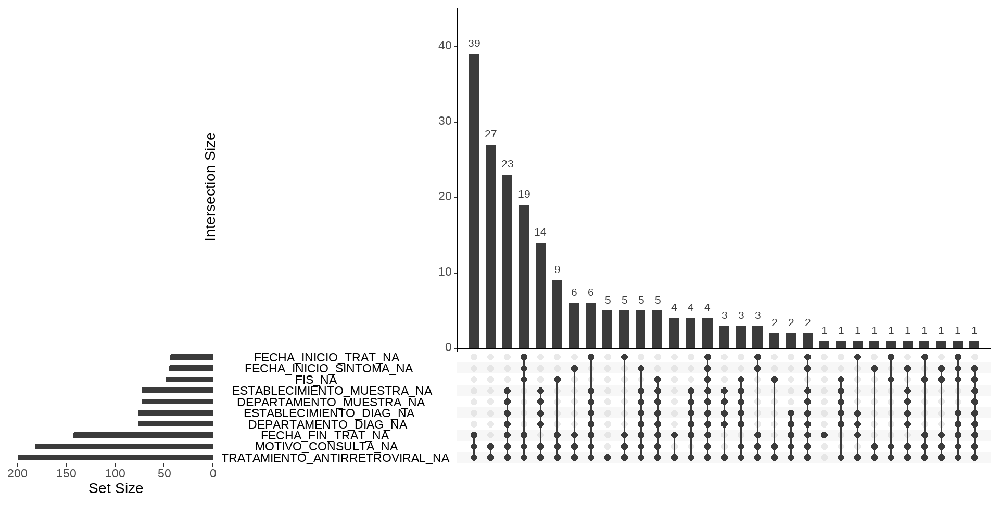

{fig-align="center" width="40%"}

## ¿Por qué importan los datos ausentes?

Cuando trabajamos con datos reales, los valores ausentes o faltantes
(conocidos en inglés como *missing* - `NA` en R), son más que un
inconveniente técnico y lo que hagamos con ellos representan decisiones
analíticas con consecuencias concretas sobre la validez de las
estimaciones. Ignorarlos o tratarlos de forma descuidada puede
introducir sesgo de selección, alterar la representatividad de la
muestra e implicar supuestos implícitos sobre el proceso que generó los
datos.

Por eso, antes de continuar con el análisis, modelar o graficar, es
indispensable entender qué está pasando con los valores ausentes. Tratar
los NA no es simplemente “rellenar huecos” u omitirlos sino preguntarse
qué dicen esos huecos sobre el proceso que produjo los datos, es decir,
si existe un mecanismo de ausencia subyacente.

## Contexto para la toma de decisiones

Antes de definir cómo proceder frente a valores ausentes, es necesario
contextualizar cada caso y preguntarse por qué esa información no está
presente en la tabla de datos.

Un dato aislado rara vez es interpretable por sí mismo, su sentido suele
estar anclado en el proceso de recolección y registro. En este punto,
los metadatos asociados a la tabla de datos (por ejemplo, el diccionario
de datos) resultan fundamentales, ya que permiten evaluar si la ausencia
responde a errores de medición o carga —lo que podría justificar su
corrección o exclusión, siempre debidamente documentada— o si, por el
contrario, es inherente al fenómeno en estudio, en cuyo caso eliminarla
implicaría perder información relevante.

La mejor solución para el manejo de datos ausentes es prevenir su
aparición. Esto supone fortalecer los procesos de recolección y carga de
datos, minimizando la pérdida de información desde el origen.

Sin embargo, en la práctica, con frecuencia no es posible recuperar los
datos faltantes. En esos escenarios, nuestro rol como analista consiste
en procesar la información disponible y explicitar de manera
transparente qué decisiones se adoptaron frente a los valores ausentes y
bajo que supuestos.

## Mecanismos de ausencia

Técnicamente se reconocen tres tipos de mecanismo, con implicancias muy
distintas para el análisis:

**MCAR — Missing Completely at Random** (ausencia completamente
aleatoria)

La probabilidad de que un dato falte no depende ni de las variables
observadas ni del valor ausente en sí. El mecanismo es independiente de
todo lo demás. Bajo MCAR, eliminar casos con datos faltantes no
introduce sesgo en las estimaciones (medias, coeficientes de regresión,
etc.), aunque sí reduce el tamaño muestral y la potencia estadística. En
la práctica, asumir MCAR es cómodo pero raramente justificado con datos
reales.

**MAR — Missing at Random** (ausencia dependiente de lo observado)

La ausencia depende de las variables observadas, pero no del valor que
falta, una vez que se condiciona en esas variables. En este caso,
ignorar el patrón de ausencia y eliminar filas puede introducir sesgo,
ya que la estructura de covariables estará desbalanceada entre los casos
observados y los ausentes.

Supongamos, por ejemplo, que tenemos la variable *nivel de colesterol*
con valores faltantes y la edad de la persona que está completa. Existe
un escenario posible de mecanismo que puede explicarse en que las
personas más jóvenes tienen menos probabilidad de hacerse un análisis y
ello explica los NA en colesterol.

Entonces en MAR, los datos no están simplemente “faltando al azar” en
sentido coloquial, sino “al azar condicionalmente a lo observado”.

**MNAR — Missing Not at Random** (ausencia dependiente del valor
faltante)

La ausencia depende del propio valor no observado. Es el caso más
problemático: no se resuelve con técnicas estándar de imputación.
Requiere modelos explícitos del mecanismo de no respuesta, análisis de
sensibilidad o información externa.

Un ejemplo para esta situación la tenemos en suponer un estudio
poblacional sobre el consumo de alcohol y que parte de los participantes
no responda a la pregunta. Es plausible que las personas con consumos
más altos tengan mayor probabilidad de no responder (por estigma,
deseabilidad social o temor a consecuencias).

## Los NA también son información

El patrón de ausencia puede ser en sí mismo predictivo. En
epidemiología, por ejemplo, el hecho de que un dato no esté registrado
rara vez es fortuito y suele ser una señal sistemática asociada a
características del paciente, del sistema de registro o del contexto
clínico. Crear un indicador binario de “dato faltante” puede capturar
mecanismos de comportamiento relevantes como la no respuesta, el
abandono o la ocultación deliberada:

```{r, echo=T, eval=F}
datos <- datos |> mutate(edad_na = is.na(edad))
```

Este indicador no reemplaza la imputación, pero puede ser útil como
variable adicional en modelos o para explorar el mecanismo de ausencia.

## El error más común: eliminar filas con al menos un NA

La eliminación masiva de observaciones con datos ausentes es una forma
de sesgo de selección.

Cuando una tabla tiene muchos NA, eliminar todas las filas incompletas
equivale a redefinir silenciosamente la población de estudio: ya no se
trabaja con “todos los individuos”, sino con “los individuos con datos
completos”.

Si la completitud de los datos está asociada a variables relevantes, la
muestra resultante deja de representar a la población objetivo, y el
modelo puede ajustarse a una subpoblación diferente.

Las consecuencias concretas son: alteración de la composición de la
muestra, distorsión de las asociaciones estimadas y sesgo en medidas de
interés como OR o RR.

Por ejemplo, si los pacientes más graves tienen mayor cantidad de datos
ausentes y se los elimina del análisis, se subestima el riesgo real en
la población.

## Limitaciones de la imputación simple

Un método frecuente consiste en reemplazar los NA por un valor resumen
de la distribución (media o mediana). Sin embargo, la imputación con la
media no es “gratuita” sino que modifica la estructura de los datos de
manera que reduce artificialmente la variabilidad, debilita las
correlaciones entre variables, sesga los coeficientes estimados y genera
intervalos de confianza artificialmente estrechos.

En definitiva, se introducen observaciones deterministas que nunca
existieron.

## Métodos avanzados

La imputación avanzada es un campo extenso que excede los objetivos de
esta cursada, pero mencionaremos su existencia. Las técnicas más
utilizadas son:

- Imputación múltiple (paquetes de R mice, Amelia): genera varias
  versiones del conjunto de datos con distintas imputaciones plausibles
  y combina los resultados mediante reglas estadísticas formales,
  produciendo estimaciones que incorporan la incertidumbre sobre los
  valores faltantes.

- Modelos bayesianos: permiten incorporar esa incertidumbre de forma
  natural dentro del propio modelo de análisis.

- Machine learning: algunos algoritmos (como los basados en árboles
  -random forest-) manejan NA de forma nativa o mediante imputación por
  proximidad entre observaciones similares.

Estos métodos no eliminan la necesidad de reflexionar sobre el mecanismo
de ausencia (lo hacen más explícito) y, en algunos casos, permiten
modelarlo directamente. Ninguno de ellos es una solución automática y
todos requieren decisiones informadas sobre el contexto y los datos.

## Detectar observaciones incompletas en R

El lenguaje R gestiona a los datos perdidos mediante el valor especial
reservado `NA` de **Not Available** (No disponible).

En principio, sólo vamos a enfocarnos en como podemos utilizar algunas
funciones del lenguaje para detectarlos y contabilizarlos. A partir de
su identificación decidiremos que hacer con ellos, dependiendo de su
cantidad y extensión, es decir, si los valores faltantes son la mayoría
de una variable o la mayoría de una observación o bien si representan la
falta de respuesta de una pregunta, con lo cual convenga etiquetarlos.

Una manera de abordar esta tarea con R base para una variables es hacer
la sumatoria de valores `NA`, usando la función de identificación
`is.na()`.

Para ejemplificar, tomamos una tabla de datos de vigilancia con 200
observaciones y 56 variables.

```{r}
#| echo: false
#| message: false
#| warning: false

library(tidyverse)
library(readxl)

datos <- read_excel("datos/base2023r.xlsx")
```

```{r}
datos |> 
  summarise(Cantidad_NA = sum(is.na(FECHA_FIN_TRAT)))
```

La consulta dice que hay 142 observaciones vacías en la variable
FECHA_FIN_TRAT. Lo malo es que debemos hacer esta tarea variable por
variable, lo que resulta muy trabajoso.

También la función `summary()` aplicada sobre el dataframe completo
informa la cantidad de `NA` de variables cuantitativas, lógicas y fecha,
pero no lo hace con las de tipo caracter.

```{r}
summary(datos)
```

Más completo y en una sola línea la función `find_na()` del paquete
**dlookr** muestra el porcentaje de valores perdidos en todas las
variables de una tabla de datos y se complementa con el gráfico de
barras de pareto `plot_na_pareto()`.

```{r}
#| message: false
#| warning: false
library(dlookr)

find_na(datos, rate = T) # argumento rate = T muestra % de valores NA

```

```{r}
#| out-width: 120%
#| message: false
#| warning: false
plot_na_pareto(datos, 
               only_na = T) # argumento only_na = T muestra variables solo con algún valor NA 
                                   
```

## Gestión de NA's con naniar

{fig-align="center" width="10%"}

El paquete **naniar** es un paquete que reúne funciones diseñadas para
el manejo de valores ausentes pensado para una gestión completa.

```{r}
library(naniar)
```

Sus caracteristicas generales son:

- Proporciona funciones analíticas y visuales de detección y gestión

- Es compatible con el mundo "tidy" de tidyverse

- Aborda las relaciones o estructura de la falta de datos.

- Posibilita el trabajo de imputación (no tratado en este curso)

De las muchas funciones que tiene el paquete seleccionamos algunas para
mostrar que son muy útiles para una tarea básica.

La función `miss_var_summary()` proporciona un resumen sobre los valores
NA en cada variable del dataframe similar a `find_na()` que vimos
anterioremente pero con una salida en forma de tabla y un recento
absoluto, además de porcentual.

```{r}
miss_var_summary(datos)
```

Por el lado gráfico, ofrece la función `gg_miss_var()` que representa la
información de la tabla anterior pero a través de un gráfico *lollipop*
horizontal de tipo **ggplot2**.

```{r}
#| out-width: 120%
gg_miss_var(datos, 
            show_pct = T) # muestra valores en porcentajes
```

Hay otra viaulización muy interesante porque muestra las relaciones de
los valores ausentes de las variables cuya función se llama
`gg_miss_upset()` y genera un gráfico **Upset** en función de la
existencia de valores NA.

```{r}
#| eval: false

gg_miss_upset(datos) 
```

 Por defecto, construye el gráfico tomando las
primeras 10 variables de la tabla de datos con valores NA de forma
decreciente. Esto se puede modificar cambiando el argumentos `nset =`.

Tiene dos entradas para su lectura. En la parte inferior izquierda nos
muestra los nombres de las variables con valores NA ordenadas de menor a
mayor medida en una escala absoluta. El gráfico de barras principal,
ordenado de forma predeterminada de mayor a menor, informa sobre las
cantidades absolutas de valores NA de las combinaciones que aperecen
debajo del eje x del gráfico.

Por ejemplo, la variable ETNIA tiene todos sus observaciones como NA y
la variable COVID casi lo mismo, mientras que la variable FIS cerca de
50.

Podemos eliminar del gráfico a esas dos variables con casi todos los
valores NA, usando formas de tidyverse previas dado que las funciones de
naniar son compatibles.

```{r}
#| eval: false
datos |> 
  select(-ETNIA, -COVID) |> 
  gg_miss_upset() 
```



Al quitar esas dos variables, aparecen dos nuevas con cantidades menores
de NA que FIS (FECHA_INICIO_TRAT y FECHA_INICIO_SINTOMA), es decir
siguen siendo 10 por defecto.

Si miramos los datos faltantes con estructura notamos que la combinación
más frecuente de NA combinados es FECHA_FIN_TRAT, MOTIVO_CONSULTA y
TRATAMIENTO_ANTIRETROVIRAL con 39 observaciones a las que le faltan
valores en las tres variables simultáneamente.

## Reemplazo de valores

El paquete tiene además dos funciones de reemplazo que funcionan como
herramientas antagónicas.

`replace_with_na()` reemplaza valores o etiquetas específicas con
valores NA y `replace_na_with()` hace lo contrario, reemplaza valores NA
con valores específicos, como "Sin dato" por ejemplo.

La primera función trabaja sobre el dataframe completo adignando valores
NA en la categoría o valor que le indiquemos.

Por ejemplo, la variable ID_PROV_INDEC_RESIDENCIA no tiene valores
perdidos pero si hay una categoría/código desconocido ("00"), entonces
podemos decirle que ese código sea NA.

```{r}
datos |> 
  summarise(Cantidad_NA = sum(is.na(ID_PROV_INDEC_RESIDENCIA)))

datos |> 
   replace_with_na(replace = list(ID_PROV_INDEC_RESIDENCIA = "00")) |>     
  summarise(Cantidad_NA = sum(is.na(ID_PROV_INDEC_RESIDENCIA)))
```

`replace_na_with()` etiqueta valores faltantes con categorías definidas
que serán tenidas en cuenta a la hora de hacer tablas u otras
operaciones. Esta función se utiliza dentro de `mutate()` del tidyverse.

La variable MOTIVO_CONSULTA tiene 181 valores NA que serán etiquetados
como "Sin dato" de esta forma:

```{r}
datos |> 
  count(MOTIVO_CONSULTA)

datos |> 
  mutate(MOTIVO_CONSULTA = replace_na_with(MOTIVO_CONSULTA, 
                                           "Sin dato")) |> 
  count(MOTIVO_CONSULTA)
```

## Eliminación de valores NA

Cuando decidimos eliminar valores NA de alguna variable, salvo que se
quite la variable entera, tenemos que tener en cuenta que perdemos la
observación completa, incluso valores válidos que se encuentran en otras
variables.

R base tiene una función llamada `na.omit()` que omite toda observación
donde al menos haya un solo NA en alguna variable.

```{r}
na.omit(datos)
```

Aplicar esta función sobre el dataframe datos produce que no quede
ninguna observación, dado que vimos que la variable ETNIA tenía sus
doscientos valores vacíos.

Una función superadora es `drop_na()` de tidyr que pertenece a
tidyverse, porque omite observaciones que tengan variables que
definamos, por ejemplo:

```{r}
datos |> 
  drop_na(ETNIA)

datos |> 
  drop_na(FIS)
```

En el ejemplo anterior aplicamos la función sobre la variable ETNIA y
FIS, en el primer caso omite todas las observaciones y en el segundo
caso 48 observaciones, mostrando las 152 restantes sin NA en la
variable.

Por último, debemos saber que eliminar observaciones por valores
faltantes reduce la potencia de cualquier test de hipótesis o modelo que
hagamos porque se reduce el tamaño de la muestra.

| Acción | Herramienta en R |
|------|------|
| Cuantificar NA por variable     | find_na() (dlookr), miss_var_summary() (naniar)     |
| Visualizar frecuencia de NA     |  plot_na_pareto() (dlookr), gg_miss_var() (naniar)    |
| Explorar combinaciones de NA     | gg_miss_upset() (naniar)     |
| Recodificar valores como NA     | replace_with_na() (naniar)     |
| Etiquetar NA como categoría     | replace_na_with() (naniar)     |
| Eliminar observaciones incompletas | drop_na() (tidyr) |
| Justificar y reportar la decisión | — |
    
## Conclusión 

No existe un tratamiento *“neutro”* de los datos ausentes. Cada decisión implica asumir algo sobre cómo se generaron los datos, qué queda dentro del análisis y qué relaciones se están estimando. La transparencia metodológica es parte del rigor analítico, por lo que toda decisión debe tomarse de forma consciente y reportarse
explícitamente.
