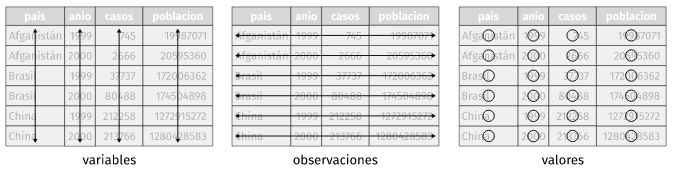
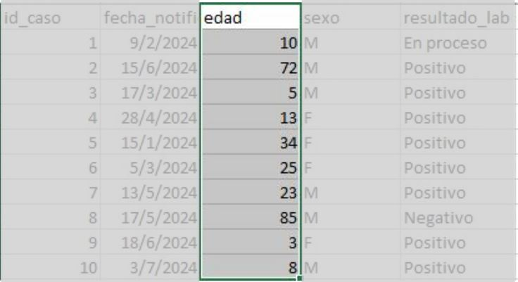
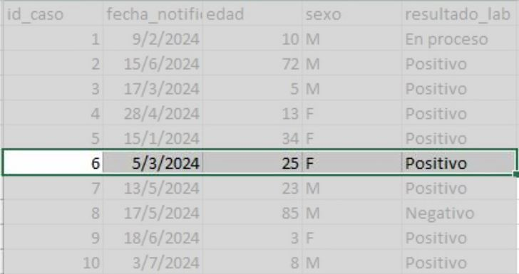
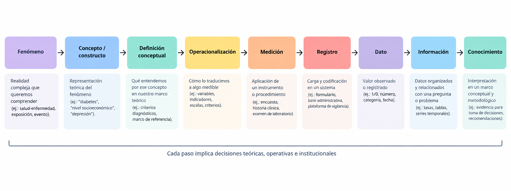

```{r setup, include=F}
#| label: setup
#| include: false


library(quarto)
library(fontawesome)
library(tidyverse)
```

## Concepto {.invert}

```{scss}

div {
  &.callout {
    font-size: 3.2rem !important;
  }
}
```

<br>
<br>

::: {.justify style="font-size: 140%;"}

La gestión de datos vinculada a procesos de investigación o vigilancia epidemiológica implica la organización, la planificación, el almacenamiento, la preservación y la difusión de los datos antes, durante y después de la etapa de análisis.

:::

## Ciencia abierta {.title-top}

<br>

La ciencia abierta tiene como objetivo hacer que la investigación y la difusión científicas sean accesibles para todos, lo que hace absolutamente necesaria la necesidad de buenas prácticas de gestión de datos.

<br>

- Marco de ciencia abierta: [Centro para la Ciencia Abierta](https://www.cos.io)

- Iniciativa y hoja de ruta, en el ámbito de la ciencia de datos, reproducible, ética y colaborativa: [The Turing Way](https://book.the-turing-way.org/)

## Fuente de datos {.title-top}

<br>

**Fuente primaria:**

. . . 

  - El término datos primarios se refiere a datos recolectados  por el investigador por primera vez 
  
. . . 

  - Suelen necesitar una gran cantidad de recursos como tiempo, dinero y mano de obra.

. . . 

  - Requieren un proceso de limpieza y depuración para tratar, previo al análisis, los datos crudos.

## Fuente de datos {.title-top}

<br>

**Fuente secundaria:**

  - Los datos secundarios implican información que ya ha sido recopilada y registrada por otra/s persona/s diferente/s al analista, generalmente para un propósito que no está relacionado con el análisis actual.

. . . 

  - se enmarcan en el paradigma de open data y por su disponibilidad no tiene costo para el investigador.

. . . 

  - A veces los datos no son lo específicos que quisiéramos.

  
## Conjuntos de datos {.title-top}

<br>

::: {.callout-note appearance="simple" icon="false"}

Un **dato** contiene la unidad mínima de información resultado de la operacionalización de una característica o constructo teórico en una unidad de análisis, mediante reglas de medición y registro.

En nuestro trabajo el dato siempre representa el valor / medida (variables cuantitativas) o modalidad / categoría (variables cualitativas) de una variable.

<br>

**Ejemplo:** la edad registrada en una historia clínica.

:::

## Conjuntos de datos {.title-top}

<br>

::: {.callout-note appearance="simple" icon="false"}

Un conjunto de datos mínimo está organizado en un formato rectangular que permite que la información sea legible por la computadora. 

Los conjuntos de datos rectangulares, también llamados **tabulares**, se componen de **columnas** y **filas** y se asocian a **una sola unidad de investigación u observación**.

::: 

<br>

**Idea clave:** los datos sólo tienen significado en su contexto (quién, cuándo, donde, cómo, para qué) y generalmente son una reducción del fenómeno. Recordar que los datos no siempre son neutrales


## Conjuntos de datos {.title-top}

<br>

Partes básicas de una tabla de datos estructurada




## Desde lo técnico: Variable vs Valor {.title-top}

<br>

::::: columns
::: {.column width="65%"}
-   **Variable:** característica que puede variar entre observaciones. Se ubica en columnas y tiene un tipo de dato definido.
:::

::: {.column width="35%"}
{fig-align="center"}
:::
:::::

. . .

::: {style="font-size: 80%;"}
-   Ej.: edad, sexo, diagnóstico, fecha de consulta.
:::

. . .

::: {style="font-size: 90%;"}
-   **Valor:** manifestación concreta de la variable para una unidad de análisis.
-   Ej.: edad = 45 (numérico); sexo = F (caracter); fecha de consulta = 2025-11-28 (fecha).
:::

## Variables {.title-top}

- Generalmente partimos desde un **concepto teórico / constructo**: (ej: nivel socioeconómico, depresión, hacinamiento, etc)

- En función de nuestro marco teórico optamos por una **definición conceptual** (basado en qué entendemos por eso en nuestro marco teórico)

- **Operacionalización**: cómo lo vamos a traducir en algo medible (ej: ingresos, educación, escala validada)

- **Medición / registro**: instrumento concreto de medición + sistema de carga (encuesta, historia clínica, base administrativa)

- **Variable**: la forma final en la tabla (para R, por ejemplo es una columna con valores)

*Cada transición implica decisiones teóricas y operativas que condicionan el dato final*.  

## Variables (columnas) {.title-top}

<br>

::: {.fragment .fade-in-then-semi-out}

- **Variables recopiladas:** son variables recogidas de un instrumento (cuestionario estrcuturado, etc) en fuentes primarias o fuente secundarias (externa).

:::

::: {.fragment .fade-in-then-semi-out}

- **Variables creadas:** variables construidas en el análisis o variables derivadas o indicadores con fines de resumen (llamada también información agregada).

:::

::: {.fragment .fade-in-then-semi-out}

- **Variables de identificación:** valores que identifiquen de forma únivoca a los sujetos en sus datos (por ejemplo, el DNI o historia clínica u otro identificador ad hoc si se desea preservar la identidad).

:::

## Atributos de las variables {.title-top}

::: {.fragment .fade-in-then-semi-out}

- **Nombre de variable**: representación corta de la información contenida en una columna (deben ser únicos)

:::

::: {.fragment .fade-in-then-semi-out}

- **Tipos de variable**: determina los valores permitidos para una variable, las operaciones que se pueden realizar en la variable y cómo se almacenan los valores.
  - numéricos (con y sin decimales), de caracteres, de fecha o lógicos (valores True y False). 

:::  
  
::: {.fragment .fade-in-then-semi-out}

- **Valores variables**: hacen referencia a la información contenida en cada columna. En cada variable se puede configurar los valores permitidos predeterminados en forma de validación a la carga de datos.

:::

## Observaciones (filas)  {.title-top}

<br>

- Las filas del conjunto de datos representan a los sujetos (también llamados registros u observaciones) de sus datos. 

- Los sujetos de su conjunto de datos pueden ser personas, hogares, ubicaciones como países o provincias, etc.

- Todas las observaciones de una tabla de datos pertenecen a una sola **unidad de observación o unidad de análisis** (entidad que deseamos estudiar, es decir, aquella que se observa para efectuar mediciones o para clasificarla en categorías)

## Unidad de análisis {.title-top}

::::: columns
::: {.column width="60%"}
-   Entidad básica sobre el que se registran los datos. Se ubica en las filas y constan de un conjunto de variables.
:::

::: {.column width="40%"}
{fig-align="center"}
:::
:::::

-   Ejemplos en salud: **Paciente**, **Consulta**, **Evento** (p. ej. notificación de enfermedad), **Hospital**, etc.

**Por qué importa:** la elección condiciona el diseño, la agregación, la dependencia y la interpretación.


## Del fenómeno al dato: cómo se construye la información epidemiológica {.title-top}

Vimos que desde el plano técnico: 

- una fila = unidad de análisis
- una columna = variable
- un valor = medición

Pero enlazado con el plano teórico:

- El dato es un registro producido, a veces no observado directamente que depende de:

- instrumentos (encuesta, historia clínica)
- sistema de registro (vigilancia, tipo de estudio)


## Base de datos {.title-top}

<br>

::: {.callout-tip appearance="simple" icon="false"}

Una base de datos es “una colección organizada de datos almacenados como múltiples conjuntos de datos”

:::

- El tipo de organización de estas bases de datos se denomina **relacionales** porque las observaciones de las tablas se *"relacionan"* entre sí mediante claves primarias y externas (foráneas).

- Las tablas suelen representar distintas unidades de observación. También puede existir una tabla principal y otras auxiliares que conectan mediante códigos.

## Datos abiertos (open data) {.title-top}

<br>

Son considerados datos abiertos todos aquellos datos accesibles y reutilizables, sin exigencia de permisos específicos.

- Tiene una ética similar a otros movimientos y comunidades abiertos, como el software libre y el código abierto.

- Hay una tendencia creciente de que la producción de datos públicos se compartan en el marco de open data para lxs ciudadanxs tengan acceso libre y la gestión sea transparente.

- En nuestro país, tanto Estado nacional, como las provincias y municipios publican repositorios o banco de datos abiertos.

## Proceso completo {.title-top}

{fig-align="center" .lightbox}

## Ejemplo para analizar {.title-top}

<br>

Veamos un ejemplo de datos abiertos sobre una encuesta de salud que se viene haciendo en Argentina desde 2005 cada 4 años aproximadamente. 

Los responsables de llevarla a cabo son el Ministerio de Salud de la Nación y el INDEC.

<br>

Uno de sus sitios es: <https://www.indec.gob.ar/indec/web/Institucional-Indec-BasesDeDatos-2> 

## Para finalizar {.title-top}

<br>

- Los datos dependen de las ideas que los organizan.

- En epidemiología, los datos son el resultado de decisiones teóricas, operativas e institucionales; analizarlos sin explicitar estos supuestos debilita la inferencia.  

- Los análisis que ejecutemos los debemos ver como un proceso iterativo entre hipótesis y datos -que dialogan entre sí- , no solo una aplicación mecánica y matemática.
