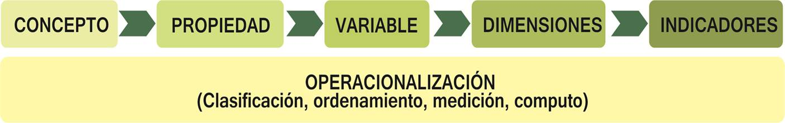
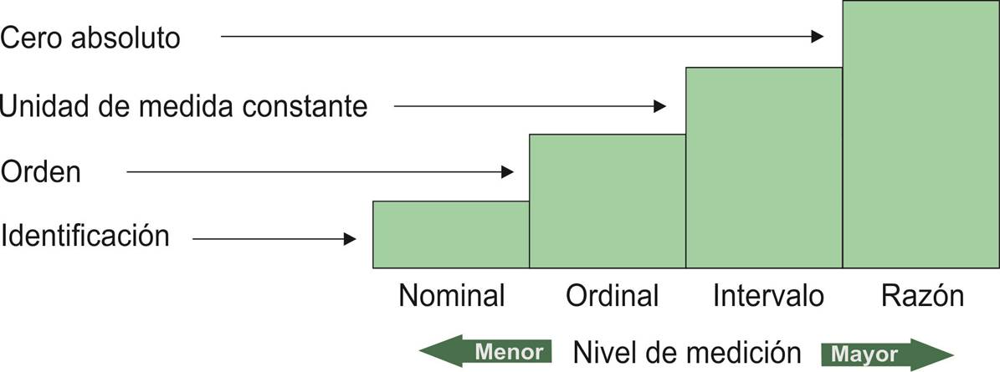
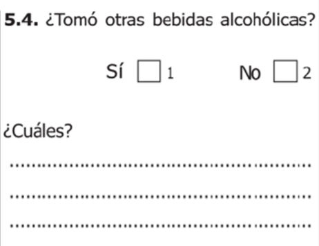
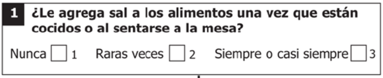
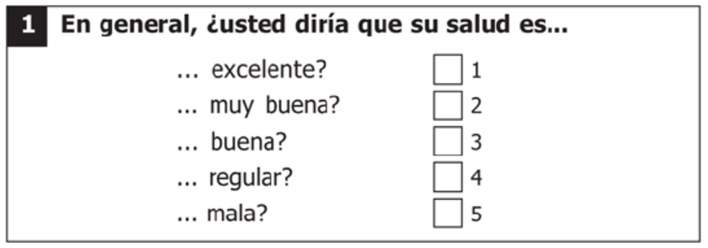
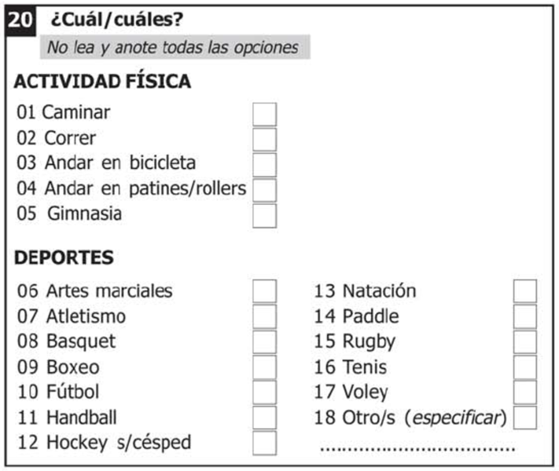
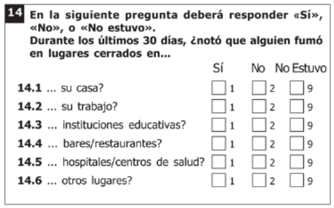
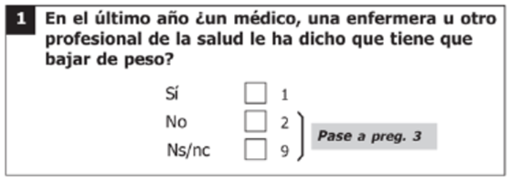
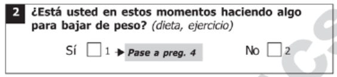

```{r setup, include=F}
#| label: setup
#| include: false


library(quarto)
library(fontawesome)
library(tidyverse)
```

## Plan de gestión de datos {.invert}

```{scss}

div {
  &.callout {
    font-size: 3.2rem !important;
  }
}
```

<br>
<br>

::: {.justify style="font-size: 150%;"}
Un plan de gestión de datos es un documento complementario sobre cómo se planea recopilar, almacenar, gestionar y compartir los productos de datos de investigación.
:::

## Plan de gestión de datos {.title-top}

- **Descripción de los datos con los que trabajamos:** Fuente, proceso de limpieza, etc.
- **Formato de los datos:** Instrumentos en papel, tipos de archivos, etc.
- **Documentación:** Diccionario de datos, manuales de procedimiento, etc.
- **Conservación de datos:** Repositorios, medidas de seguridad, etc.
- **Privacidad y la confidencialidad:** Anominización, consentimientos informados, etc.
- **Funciones y responsabilidades**

## Dato científico {.title-top}

Un dato científico esta compuesto por: 

- una unidad de observación 
- dimensiones de análisis (variables)
- valores / categorías
- definiciones operacionales (indicadores)



## Instrumentos de recolección {.title-top}

- Los instrumentos de recolección de datos característicos dentro del ámbito cuantitativo son los **cuestionarios estructurados**.

. . . 

- Existen distintos tipos de preguntas que modifican la forma en que los datos quedan expresados luego de la carga electrónica.

. . . 

- Es conveniente utilizar preguntas validadas previamente que garanticen la captura de la información adecuadamente.

## Nivel de medición de las variables {.title-top}

Las variables operacionalizadas que surjen de los cuestionarios cumpliran con algún nivel de medición:



## Tipos de variables habituales {.title-top}

<br>

::: {.fragment .fade-in-then-semi-out}
-   **Cuantitativas o numéricas** (Continuas: p. ej. edad, peso o discretas: p. ej. número de consultas)
:::

::: {.fragment .fade-in-then-semi-out}
-   **Cualitativas o categóricas** (Nominales: p. ej. sexo, diagnóstico. u ordinales: p. ej. gravedad (leve/moderado/severo).
:::

::: {.fragment .fade-in-then-semi-out}
-   **Fechas / Tiempos** (Ej.: fecha de inicio de síntomas, fecha de notificación).
:::

::: {.fragment .fade-in-then-semi-out}
-   **Lógicas** (dicotómicas Verdadero - Falso)
:::


## Preguntas: abiertas y cerradas {.title-top}

<br>

:::: {.columns}

::: {.column width="50%"}

<br>

{width=100%}

:::

::: {.column width="50%"}

<br>

{width=100%}
:::

::::

## Preguntas: simples y multiples {.title-top}

<br>

:::: {.columns}

::: {.column width="50%"}

<br>

{width=100%}
:::

::: {.column width="50%"}

<br>

{width=100%}

:::

::::

## Pregunta: batería de items {.title-top}

<br>



## Preguntas: condicionales {.title-top}


{width=70%}


{width=70%}


## Modalidades {.title-top}

<br>

- **Exahustivas:** Incluyen todas las posibles respuestas. 

  - Si la variable es "religión" y las únicas opciones son "católica", "judía" y "musulmana", no se incluyen otras religiones. 

- **Excluyentes:** Nadie puede presentar dos valores simultáneos de la variable. Cada individuo de una población debe expresar una y sólo una modalidad.

  - Un individuo puede ser diabético e hipertenso simultáneamente. En este caso es necesario definir una variable por cada opción de respuesta y que sus modalidades dicotómicas sean la ausencia o presencia de dicha opción: 
Diabetes: [si - no]  Hipertensión: [si - no]  

## Ética: identidad {.title-top}

Clasificación de archivos de datos según identificación personal: 

. . . 

- **Identificable:** es común que los datos crudos sin procesar de un estudio de investigación sean identificables.

. . . 

- **Codificado:** identificación personal eliminada o distorsionada. Reemplazo por códigos (es decir, un identificador único del participante). 

. . . 

- **Desidentificado:** identificación personal eliminada o distorsionada. No se puede volver a asociar con la persona. (compartir)

. . . 

- **Anónimo:** nunca se recopila información de identificación, por lo que debería haber poco o ningún riesgo de identificar a un participante específico.

## Ética: sensibilidad {.title-top}

::: {.fragment .fade-in-then-semi-out}

- **Baja:** datos que no presentan riesgo o presentan un riesgo bajo si se divulgan. Por lo general, esto incluye datos anónimos y no identificados que no contienen información altamente sensible.

:::

::: {.fragment .fade-in-then-semi-out}

- **Moderada:** datos que pueden incluir información identificable o información que podría permitir volver a identificar a los participantes dentro de los propios datos o utilizando una fuente externa. (protección contra el acceso no autorizado).

:::

::: {.fragment .fade-in-then-semi-out}

- **Alta sensibilidad:** medidas de seguridad más estrictas. Incluyen información personal identificable o información que podría permitir que los participantes sean reidentificados, así como información privada o altamente sensible (por ejemplo, registros médicos).

:::

## Consejos cuando trabajamos con datos {.title-top}

<br>
<br>

1.  Definir claramente la **unidad de análisis** antes de recolectar/analizar.
2.  Mantener un **diccionario de datos** actualizado (incluyendo variables construidas).
3.  Saber el **tipo de variable** para elegir análisis y gráfico adecuado.
4.  Guardar metadatos y versión de los archivos.


## Buenas prácticas {.title-top}

<br>

1. Evitar espacios en nombres.Usar guión bajo (_) o guión medio (-).
2. Evitar caracteres especiales en directorios y nombres de archivos (excepto los guiones).
3. Evitar caracteres acentuados y eñes
4. Orden útil. Clasificación alfanumérica y el completado de ceros a la izquierda cuando hay más de un dígito. Utilización del estándar ISO 8601 para fechas (AAAA-MM-DD).
5. Cuidado con la longitud de los caracteres. Tomar en cuenta toda ubicación del archivo.


## Directorios / carpetas {.title-top}

<br>

1. Nombres de carpetas significativos y fáciles de interpretar.
2. No usar espacios en los nombres de carpetas. Separar con guiones (_) o (-).
3. No usar caracteres especiales 
4. Usar una convención coherente. Uso de mayúsculas y minúsculas, etc.
5. Limitar la cantidad de caracteres
6. Agregar número de orden al comienzo del nombre de cada carpeta, con ceros a la izquierda para garantizar una clasificación adecuada (01_, 02_).

## Nombres de archivos {.smaller .title-top}

1. Nombres descriptivos (un usuario debe poder comprender el contenido del archivo sin abrirlo).
2. Evitar información de identificación personal 
2. No usar espacios en los nombres de archivos. Separar con guiones (_) o (-).
3. No usar caracteres especiales 
4. Usar una convención coherente. Uso de mayúsculas y minúsculas, etc.
5. Limitar la cantidad de caracteres.
6. Formato de fechas de forma uniforme (ISO 8601). No utilizar barras diagonales (/)  
7. Al versionar manualmente los nombres de archivos, usar un indicador consistente. (v01, v02). 
8. Agregar número de orden al comienzo del nombre de cada archivo, con ceros a la izquierda para garantizar una clasificación adecuada (01_, 02_).
9. Usar metadatos redundantes (información) en el nombre del archivo. Reduce la confusión si alguna vez se mueve a una carpeta diferente.También permite realizar búsquedas en tus archivos. Por ejemplo, coloque siempre la palabra “raw” (crudo) o “clean” (limpio) en un nombre de archivo de datos, incluso si el archivo está alojado en una carpeta “raw” o “clean”.

## Nombres de variables {.smaller .title-top}

<br>

**Obligatorio**

- No usar palabras claves o funciones reservadas (if, for, repeat, etc.)
- Establecer un límite de caracteres 
- No usar espacios ni caracteres especiales, excepto (_). 
- No comenzar el nombre de una variable con un número. 

. . . 

**Sugerido**

- Evitar acentos y eñes.
- Que todas las tablas tengan un identificador único de observación o registro. 
- Prestar atención al uso de minúsculas y mayúsculas. (case sensitive)
- Utilizar prefijos y sufijos para identificación de grupo de variables.


## Codificación de valores {.title-top}

<br>
<br>

- Deben ser únicos (evitar mismo código para categorías distintas) 
- Deben ser consistentes (evitar códigos distintos para mismas categorías)
- Ordenamiento lógico (en variables ordinales)
- Valores faltantes (dejar en blanco o usar códigos numéricos extremos de escala, 9, 99, 999, etc)


## Metadatos: diccionario de datos {.title-top}

- Son *"los datos que hablan de los datos"* e inseparables de cualquier tabla de datos que trabajemos.

- Describen origen de recolección, fecha, definiciones conceptuales y técnicas, tipo de estudio al que están asociados, etc.

::: {style="font-size: 80%;"}
Delimitador de variables: ;

Delimitador de decimales: ,

| Variable           |       Tipo | Descripción           | Valores posibles |
|--------------------|-----------:|-----------------------|------------------|
| id_caso            |   numérico | Identificador único   | 1,2,3...         |
| edad               |   numérico | Edad en años          | 0–120            |
| sexo               | categórica | Sexo biológico        | M, F, O          |
| fecha_notificacion |      fecha | Fecha de notificación | AAAA-MM-DD       |
| diagnostico        | categórica | Código CIE10          | Formato CIE10    |
:::


## Diccionario de datos {.title-top}

<br>

Todo archivo de datos o grupo de archivos que conforman una base de datos debería siempre estar acompañado por un diccionario de datos.

El **diccionario de datos** o ***codebook*** enumera: 

- nombre de variable
- descripción
- tipo de varible
- valores permitidos (escalas, códigos, categorías)

## Seguimos analizando la documentación de la ENFR 2018 {.title-top}

<br>
<br>
<br>

[Sitio Bases Salud INDEC](https://www.indec.gob.ar/indec/web/Institucional-Indec-BasesDeDatos-2)

<br>

[Diccionario de datos ENFR 2018](https://www.indec.gob.ar/ftp/cuadros/menusuperior/enfr/diccionario_registros_enfr2018.xls)