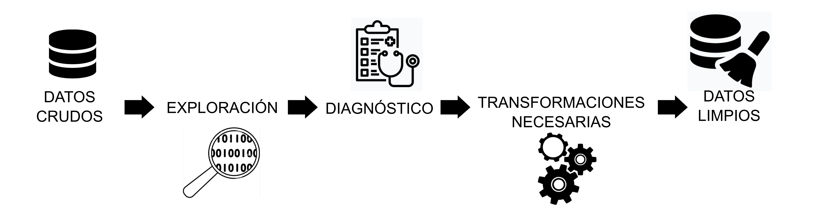
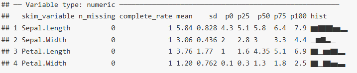
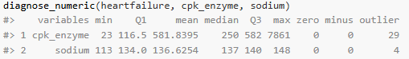
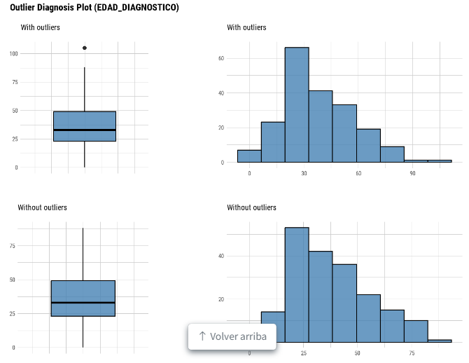

```{r setup, include=F}
#| label: setup
#| include: false


library(quarto)
library(fontawesome)
library(tidyverse)
```


## Etapas previas al análisis {.title-top}

<br>

La etapa de depuración o limpieza de datos comienza con la exploración inicial y el diagnóstico adecuado de cada variable de interés de la tabla de datos cruda. Interviene aquí también, el objetivo del análisis, el protocolo de análisis pensado y el diccionario de datos asociado a la tabla.

{.absolute top="480" left="250" width="1250"}

<br> <br> <br> <br> <br> <br>

Finalmente se hacen las transformaciones necesarias en los datos a partir del diagnóstico realizado.

## Limpieza de datos {.title-top}

{.absolute top="450" left="1250" width="600"}

<br> <br>

. . .

-   Exploración de la estructura de la tabla de datos

. . .

-   Verificación del tipo de dato de cada variable de interés

. . .

-   Detección de valores faltantes

. . .

-   Detección de errores

    -   Identificación de las categorías de las variables cualitativas

    -   Análisis de los mínimos y máximos de valores de cada variable cuantitativa

. . .

## Exploración y diagnóstico de datos {.title-top}

<br>

La exploración de datos se puede incluir dentro del **análisis exploratorio de datos** (EDA en inglés) y persigue un primer grupo de objetivos:

. . .

-   Conocer la estructura de la tabla de datos y sus tipos de variables

. . .

-   Detectar observaciones incompletas (valores faltantes)

. . .

-   Detectar datos con errores e inconsistencias

. . .

Habitualmente hablamos de ***calidad de los datos*** en relación a los items anteriores.

## Exploración y diagnóstico de datos {.title-top}

<br>

Una segunda etapa nos va servir para conocer la distribución de las variables de interés a partir de:

<br>

-   Resumir datos mediante estadísticos 
-   Visualizar distribuciones y patrones mediante gráficos
-   Detectar valores atípicos (outlier)


## Paquetes especificos {.title-top}

Vamos a trabajar con dos paquetes especiales que nos permiten hacer este trabajo, aunque dentro del universo de librerías de R vamos a encontrar muchos mas.

::: {.callout-note icon=false}
## skimr

Está diseñado para obtener un resumen rápido de la estructura de tablas de datos y es compatible con el ecosistema tidyverse.
:::

::: {.callout-note icon=false}
## dlookr

Se define como una colección de herramientas que permiten el diagnóstico, la exploración y la transformación de datos. El diagnóstico de datos proporciona información y visualización de valores faltantes, valores atípicos y valores únicos y negativos para ayudarle a comprender la distribución y la calidad de sus datos.
:::

## skimr {.title-top}

<br>

La función principal del paquete es `skim()` y devuelve un resumen del dataframe con el numero de filas y columnas, la frecuencia de tipos de variables e información de cada una de ellas: cantidad de datos faltantes, porcentaje de completitud, etc.

En las variables numéricas además nos informa de la media, el desvío estandar, los percentilos 0, 25, 50, 75, 100 y construye un mini histograma.

Para las variables tipo fecha y hora, el mínimo, máximo y la mediana.

<br>

{fig-align="center" width=60%}

## dlookr {.title-top}

<br>

Este paquete tiene varias familias de funciones destinadas a diagnosticar, EDA y transformación de datos.

Las funciones de diagnostico comienzan con `diagnose_` y utiliza como sufijo el tipo de datos que deseamos analizar (numeric, character, etc)

Informa mínimos, máximos, media, mediana, cuartiles, observaciones con ceros, números negativos, outliers, frecuencia y porcentaje de niveles, etc.

<br>

{fig-align="center" width=60%}

## dlookr {.title-top}

También tiene unas funciones que grafican los outliers, la normalidad de las variables (qq-plot), matrices de correlación (correlación entre variables numéricas), boxplot, mosaicos, etc.


{fig-align="center" width=50%}


## Duplicados {.title-top}

<br>

Otro de los problemas con los debemos lidiar muchas veces es tener observaciones duplicadas.

Las tareas habituales en estos casos son:

::: {.fragment .fade-in-then-semi-out}
-   Detección de observaciones y/o partes de observaciones (variables clave) duplicadas
:::

::: {.fragment .fade-in-then-semi-out}
-   Eliminación de duplicados a partir de observaciones únicas.
:::

::: {.fragment .fade-in-then-semi-out}
-   Recortar tabla de datos para eliminar duplicados
:::

::: {.fragment .fade-in-then-semi-out}
-   Marcar duplicados (conservando duplicados en la tabla)
:::

## Detección de duplicados {.title-top}

<br>

Las observaciones duplicadas pueden ser completas, generalmente a raíz de algún problema informático o bien parcial.

Habitualmente nuestras tablas tienen identificadores únicos de las unidades de análisis o una serie de identificadores que resultan en una clave combinada.

<br>

La función `get_dupes()` del paquete **janitor** es una herramienta útil para identificar estas repeticiones.

## Eliminación de duplicados por observaciones únicas {.title-top}

<br>

Para eliminar filas duplicadas en una tabla de datos podemos utilizar la función `distinct()` de **dplyr**.

<br>

`distinct()` muestra observaciones únicas a partir de la coincidencia total o parcial.

<br>

La función tiene un argumento denominado `.keep_all` que permite valores *TRUE* o *FALSE*. Si se iguala a *TRUE* se mantienen en el resultado todas las variables que son parte de la tabla, aunque estas no estén declaradas dentro del `distinct()`.

Por defecto, este argumento se encuentra igualado a *FALSE*.

## Eliminación de duplicados por recorte de observaciones {.title-top}

<br>

Recortar es similar a filtrar, la diferencia está en que se filtra por condiciones y recortamos por posiciones.

La familia de funciones que se puede utilizar para recortar es `slice_*()`.

Estas funciones pueden ser muy útiles si se aplican a un dataframe agrupado porque la operación de recorte se realiza en cada grupo por separado.

<br>

Por ejemplo, si en una tabla hay varias filas por persona con fechas distintas de un seguimiento y queremos quedarnos con la última visita, podemos utilizar combinado `group_by()` y `slice_max()` para quedarnos sólo con esa observación del último encuentro para cada uno.

## Marcar duplicados {.title-top}

<br>

Si lo que buscamos es mantener a todas las observaciones de la tabla pero marcar aquellos que consideramos duplicados podemos hacer:

1.  Recortar el dataframe original a sólo las filas para el análisis. Guardar los ID de este dataframe reducido en un vector.

2.  En el dataframe original, creamos una variable de marca usando `case_when()`, basándonos si el ID está presente en el dataframe reducido (vector de ID anterior).


## Datos ausentes (NA´s) {.title-top}

<br>

- Los valores ausentes (`NA` en R) son, además de problemas  técnicos en nuestros datos, decisiones analíticas con consecuencias concretas sobre la validez de las estimaciones.

- Ignorarlos o tratarlos de forma descuidada puede introducir sesgo de selección, alterar la representatividad de la muestra e implicar supuestos implícitos sobre el
proceso que generó los datos.

- Por eso, antes de continuar con el análisis, es indispensable entender qué está pasando con los valores ausentes.

## Datos ausentes (NA´s) {.title-top}

<br>

Estos datos ausentes generalmente pueden ser:

. . .

- **Informativos**: Implican una causa estructural en la recopilación de los datos o anomalías en el entorno de observación.

. . .

- **Aleatorios**: tienen lugar independientemente del proceso de recopilación de datos.

. . .

A los primeros se le suele asignar un valor concreto ("S/D", etc.) y tenerlos en cuenta en el conteo de frecuencias, en cambio a los segundos se los elimina o imputa dependiendo de la situación.

. . .

Antes de decidir el procedimiento a seguir, debemos detectarlos y describirlos, pero siempre habrá que informar lo que se hizo con ellos.


## Datos ausentes (NA´s) {.title-top}

<br>

La respuesta de qué hacer con esos valores ausentes es inherente a cada situación particular en la que estemos. No hay una solución mágica ni automática para todos los casos.

. . .

Siempre habrá que sospechar que esos NA son información valiosa y tendremos que descartar un patrón de ausencia subyacente.

. . .

Apliquemos la solución que definamos, previamente tenemos que:

- detectar y cuantificar los `NA`
- explorar la estructura de los `NA` 
- decidir y documentar

## Manejo de NA's con naniar {.title-top}

{.absolute top="25" left="1350" width="200"}

<br>
<br>
<br>
<br>

El paquete **naniar** reúne funciones para el manejo de valores faltantes (NA en R).

<br>

-   Proporciona funciones analíticas y visuales de detección y gestión.

-   Es compatible con el ecosistema *"tidy"* de tidyverse

-   Posibilita el trabajo de imputación (aunque no lo trataremos en el curso)

## Paquete naniar {.title-top}

De las muchas funciones que tiene el paquete seleccionamos algunas para mostrar que son muy útiles para nuestra tarea habitual.

`miss_var_summary()`: proporciona un resumen analítico sobre los valores NA en cada variable del dataframe

`gg_miss_upset()`: genera un gráfico Upset sobre los valores NA de dataframe

`replace_with_na()`: reemplaza valores específicos con valores NA

`replace_na_with()`: reemplaza valores NA con valores específicos

{fig-align="center" width=50%}

## Ejemplo de un UpSet de valores perdidos 

Gráfico para explorar posibles **patrones** de valores ausentes.

```{r}
#| echo: false
#| message: false
#| warning: false
#| fig-align: center
#| fig-height: 9
#| fig-width: 18


datos <- readxl::read_excel("datos/Enterovirus_practicas_depuracion.xlsx")
library(naniar)

datos |> 
  dplyr::select(where(~any(is.na(.)))) |> 
  gg_miss_upset(nsets = 15)
```


## Distintas eliminaciones según decisión tomada

<br>

- Si decidimos eliminar una variable completa porque tiene muchos valores ausentes:

```{r, eval=FALSE, echo=TRUE}

nombre_dataframe <- nombre_dataframe |> 
  select(-var_con_datos_ausentes)
```

<br>

Usar la función de selección negando la variables en cuestión es suficiente para producir un nuevo dataframe o sobreescribir el original sin ella.


## Distintas eliminaciones según decisión tomada

<br>

- Si decidimos eliminar todos los valores ausentes de una tabla de datos (proceso menos recomendable en la mayoría de los situaciones):

```{r, eval=FALSE, echo=TRUE}

nombre_dataframe <- na.omit(nombre_dataframe)
```

<br>

Usar la función `na.omit()` del R base  elimina observaciones enteras donde al menos haya una variable con valores `NA`. Produce una tabla con completitud de datos pero suele disminuir la cantidad de observaciones si la tabla original tiene muchos valores ausentes.

## Distintas eliminaciones según decisión tomada

<br>

- Si decidimos eliminar todos los valores ausentes de determinada variable o variables (`na.omit()` no permite hacerlo)):

```{r, eval=FALSE, echo=TRUE}

nombre_dataframe <- nombre_dataframe |> 
  drop_na(nombre_variable)
```

<br>

Usar la función `drop_na()` del paquete tidyr del tidyverse elimina observaciones enteras donde haya valores `NA` dentro de la variable escrita. Produce una tabla con completitud de datos en la variable seleccionada y dependiendo de la cantidad de valores ausentes de dicha variable será la cantidad de observaciones finales que tengamos.


