```{r setup, include=F}
#| label: setup
#| include: false


library(quarto)
library(fontawesome)
library(tidyverse)
```

## Operaciones simultáneas por columnas {.title-top}

. . .


La filosofía de trabajo de **tidyverse** se plantea *nunca copiar y pegar más de dos veces* el código escrito, pero cuando necesitamos realizar la misma operación en un conjunto de variables simultáneamente nos encontramos con este problema.

. . .

La solución, ofrecida dentro de **dplyr**, es un andamiaje que permite aplicar funciones y expresiones a varias columnas simultáneamente.

. . .

Es una forma de **iteración**, donde se repite la misma acción en diferentes objetos. En este caso los objetos serán columnas (*variables*) de la tabla de datos.

. . .

Las operaciones simultáneas pueden darse como transformación (dentro de un `mutate()`) o de resumen (dentro de un `summarise()`)

## Operaciones simultáneas por columnas {.title-top}

<br>

Creación de múltiples columnas con **mutate()**

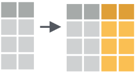{fig-align="center" width="500"}


Resumiendo múltiples columnas con **summarise()**

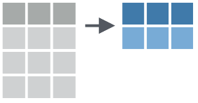{fig-align="center" width="500"}

## Función across() {.title-top}


La función `across()` es la encargada de dar soporte a estas operaciones múltiples (*dplyr \>= 1.0.0*).


```{r}
#| echo: true
#| eval: false
#| code-line-numbers: false

across(.cols,  .fns,  ...,  .names)
```

<br>

`.cols` = columnas a transformar

`.fns` = función o funciones para aplicar a cada columna de `.cols`

`...` = argumentos adicionales de las funciones especificadas anteriormente (*ejemplo*: na.rm = T)

`.names` = nombres de las columnas de salida. Aquí, `{.col}` es un marcador especial al que se le puede agregar el sufijo deseado.

## Resúmenes múltiples {.title-top}

<br>

Tomemos la siguiente tabla de datos ficticios (mostramos las primeras 4 observaciones):

```{r}
#| echo: false
#| message: false
#| warning: false

library(tidyverse)

set.seed(123)

datos <- tibble(
  a = rnorm(10),
  b = rnorm(10),
  c = rnorm(10),
  d = rnorm(10)
)

datos |> head(4)
```

<br>

Supongamos que queremos calcular la media de cada variable...

## Resúmenes múltiples {.title-top}

Podríamos hacerlo repitiendo para cada variable

```{r}
#| echo: true

datos |> summarise(
  a = mean(a),
  b = mean(b),
  c = mean(c),
  d = mean(d),
)
```

<br>

Pero esto rompe la regla general que buscamos de nunca copiar y pegar más de dos veces...

## Resúmenes múltiples {.title-top}

Para solucionarlo aplicamos `across()` y realizamos el resumen simultáneo en una sola línea.

```{r}
#| echo: true

datos |> summarise(
  across(.cols = a:d, .fns = mean),
)
```

<br>

Nótese que el primer argumento es el rango de nombres de variables y el segundo la función que aplicamos a todas ellas (*nombres de funciones sin paréntesis*).

## Seleccionar variables (**.cols**) {.title-top}

<br>

El primer argumento de `across()` responde de la misma forma que la función `select()` y aplican también las *funciones ayudantes de selección*.

```{r}
#| echo: false

datos <- tibble(
  grupo = sample(2, 10, replace = TRUE),
  a = rnorm(10),
  b = rnorm(10),
  c = rnorm(10),
  d = rnorm(10)
)
```

```{r}
#| echo: true

names(datos)

datos |> 
  group_by(grupo) |> 
  summarize(across(everything(), mean))
```

## Recordamos a las funciones ayudantes de selección {.title-top .smaller}

<br>

::: columns
::: {.column width="50%"}
-   `everything()`: coincide con todas las variables.

-   `group_cols()`: seleccione todas las columnas de agrupación.

-   `starts_with()`: comienza con un prefijo.

-   `ends_with()`: termina con un sufijo.

-   `contains()`: contiene una cadena literal.

-   `matches()`: coincide con una expresión regular.
:::

::: {.column width="50%"}
-   `num_range()`: coincide con un rango numérico como x01, x02, x03.

-   `all_of()`: coincide con nombres de variables en un vector de caracteres. Todos los nombres deben estar presentes; de lo contrario, se generará un error de fuera de límites.

-   `any_of()`: igual que `all_of()`, excepto que no se genera ningún error para los nombres que no existen.

-   `where()`: aplica una función a todas las variables y selecciona aquellas para las cuales la función regresa TRUE.
:::
:::

## Expresiones de selección {.title-top}

<br>

El argumento `.cols` también puede recibir construcciones *booleanas* utilizando los operadores conocidos como `!` (negación) y conectores lógicos como `&` (AND) y `|` (OR) entre las funciones ayudantes de selección.

<br>

Por ejemplo:

```{r}
#| echo: true
#| eval: false

.cols = !where(is.numeric) & starts_with("a")
```

<br>

Selecciona todas las columnas no numéricas, cuyo nombre comienza con "a".

## Agregar argumentos a las funciones {.title-top}

<br>

Hasta ahora vimos el ejemplo de aplicar una función simple como `mean()` a un grupo de variables.

. . . 

<br>

Que sucede si entre los datos de esas variables hay valores **NA**?

Vamos a necesitar incorporar el argumento `na.rm = TRUE` a la función.

. . .

<br>

Donde lo hacemos dentro de un `across()`?

## Agregar argumentos a las funciones {.title-top}

<br>

Supongamos que tenemos estos datos (mostramos algunas observaciones):

```{r}
#| echo: false

set.seed(123)

rnorm_na <- function(n, n_na, mean = 0, sd = 1) {
  sample(c(rnorm(n - n_na, mean = mean, sd = sd), rep(NA, n_na)))
}

datos_na <- tibble(
  a = rnorm_na(5, 1),
  b = rnorm_na(5, 1),
  c = rnorm_na(5, 2),
  d = rnorm(5)
)

datos_na |> head(4)
```

<br>

Vemos algunos valores **NA** entre las observaciones.

## Agregar argumentos a las funciones {.title-top}

<br>

Si aplicamos el mismo código de `across()` anterior tendríamos como resultado:

```{r}
#| echo: true

datos_na |> 
  summarise(
    across(a:d, mean)
  )
```

<br>

Sería bueno que le pasaramos `na.rm = TRUE` a la función `mean()`.

## Agregar argumentos a las funciones {.title-top}

Existen dos formas sintácticas de hacerlo.

-   Una función estilo-purrr (tidyverse): `~ mean(.x, na.rm = TRUE)`

-   Una función anónima (base): `function(x) mean(x, na.rm = TRUE)` ; o mejor en su forma de atajo: `\(x) mean(x, na.rm = TRUE)`

```{r}
#| echo: true

datos_na |> 
  summarise(
    across(a:d, \(x) mean(x, na.rm = TRUE))
  )
```

## Múltiples funciones {.title-top}

Para incorporar más de una función dentro de `across()` debemos incluirlas dentro de una lista \[`list()`\]

```{r}
#| echo: true

datos_na |> 
  summarise(
    across(a:d, list(
      media = \(x) mean(x, na.rm = TRUE),
      n_na = \(x) sum(is.na(x))))
  )
```

La lista contiene cada función a aplicar, bajo nombres definidos.

## Cambiar nombres de resultados {.title-top}

<br>

Observemos que los nombres de las variables resultado se componen del nombre de la columna, un guión bajo y el nombre definido de la función aplicada, para distinguir entre las múltiples funciones del `across()`.

La estructura de estos nombres se pueden modificar con el argumento `.names` de `across()`.

Los marcadores especiales para el nombre de columna es `{.col}` y para el nombre de la función definida es `{.fn}`.

## Cambiar nombres de resultados {.title-top}

<br>

Por ejemplo, podríamos invertir el orden predeterminado de los nombres del resumen.

```{r}
#| echo: true

datos_na |> 
  summarise(
    across(a:d, list(
      media = \(x) mean(x, na.rm = TRUE),
      n_na = \(x) sum(is.na(x))),
      .names = "{.fn}_{.col}")
  )
```

## Transformación de tipos de datos {.title-top}

<br>

Hasta ahora vimos como funciona la función `across()` dentro de un resumen (`summarise`) pero al comienzo también dijimos que se puede utilizar para transformaciones masivas de datos.

<br>

Para lograr esto la función se vincula con `mutate()` modificando las variables originales o bien creando nuevas variables si cambiamos su nombre con `.names`.

## Transformación de tipos de datos {.title-top}

<br>

Aplicamos la función `coalesce()` para convertir los valores **NA** en ceros, transformando las variables originales.

```{r}
#| echo: true

datos_na |> 
  mutate(
    across(a:d, \(x) coalesce(x, 0))
  )
```

## Transformación de tipos de datos {.title-top}


Hacemos lo mismo pero cambiamos los nombres de las variables de salida del `mutate()` que van a coexistir con las originales.

```{r}
#| echo: true

datos_na |> 
  mutate(
    across(a:d, \(x) coalesce(x, 0),
      .names = "{.col}_na_cero")
  )
```

## Filtros {.title-top}

<br>

En el caso de iteraciones similares para incluir dentro de la función `filter()` el paquete dplyr propone dos funciones específicas: `if_any()` e `if_all()`.

<br>

En el primer caso, la función enmascara una repetición de OR lógicos y en la segunda una secuencia de AND lógicos.

## Filtros {.title-top}

```{r}
#| echo: true

datos_na |> filter(if_any(a:d, is.na))
```

Es lo mismo que `filter(is.na(a) | is.na(b) | is.na(c) | is.na(d))`

```{r}
#| echo: true

datos_na |> filter(if_all(a:d, is.na))
```

Es lo mismo que `filter(is.na(a) & is.na(b) & is.na(c) & is.na(d))`

## Filtros {.title-top}

<br>

Las dos funciones de filtro trabajan con el mismo esquema que `across()`, por lo tanto se le puede aplicar una función o expresión de condición (debe devolver `TRUE` o `FALSE`)

<br>

```{r}
#| echo: true

datos  |> filter(if_all(a:d, \(x) x > -0.5 & x < 1))
```


## Paquete rstatix {.title-top}

<br>

El paquete `rstatix` simplifica el proceso de realizar análisis estadísticos complejos. 
   
. . .
   
- sintaxis intuitiva y basada en el paradigma de la *"gramática de datos"* de tidyverse

. . .

- permite realizar pruebas estadísticas comunes, como t-tests, ANOVA, y correlaciones, de manera rápida y eficiente 

. . .

- diseño que facilita la integración de resultados en flujos de trabajo de análisis reproducibles, asegurando que las conclusiones derivadas de los datos sean robustas y transparentes.

## Paquete rstatix {.title-top}

- Muchas de sus funciones son espejos de las funciones estadísticas de R base pero compatibles con tidyverse, por lo que siempre devuelven los resultados en dataframes

```{r}
#| echo: false
#| message: false
#| warning: false
library(tidyverse)
library(readxl)

datos <- read_excel("datos/valores.xlsx")
```


```{r}
#| echo: true
#| message: false
#| warning: false
library(rstatix)

datos |> 
  t_test(Edad ~ Sexo)
```
Lo que nos permite conectar el resultado mediante tuberías hacia otras funciones del tidyverse, como `select()` o `filter()`.

## Paquete rstatix {.title-top}

<br>

Tiene dos funciones de resumenes para variables cuantitativas y cualitativas:

```{r}
#| echo: true
datos |> get_summary_stats(Edad, type = "mean_sd")

datos |> get_summary_stats(Edad, type = "median_iqr")
```


## Paquete rstatix {.title-top}

```{r}
#| echo: true
datos |> group_by(Sexo) |> 
  get_summary_stats(Edad, type = "common")

datos |> freq_table(Sexo)
```


## Paquete janitor {.title-top}

<br>

El paquete janitor tiene numerosas funciones de las cuales vamos a destacar la familia **tabyl**.

. . .

<br>

La función `tabyl()` permite crear tablas de frecuencia de una variable o tablas de contingencia para dos o más variables categóricas.

. . .

<br>

El paquete además tiene otras funciones que se enlazan con tabyl para personalizar los resultados en estas tablas (por ejemplo, agregar totales o representar frecuencias realtivas como porcentajes)

## Paquete janitor {.title-top}

Se puede personalizar la tabla conectando por tuberías el agregado de otras funciones del paquete. 

```{r}
#| echo: true
#| message: false
#| warning: false
library(janitor)
datos  |>   
  tabyl(Sexo) |>  
  adorn_totals(where = "row") |>  
  adorn_pct_formatting(digits = 2) 
```

Incorporamos totales con `adorn_totals()` y configuramos los porcentajes con `adorn_pct_formatting()`.


## gtsummary {.title-top}

<br>

Este paquete permite crear tablas de resumen elegantes y personalizables que destacan las estadísticas descriptivas, resultados de modelos, y comparaciones de grupos. 

. . . 

Estas tablas son esenciales para reportes, publicaciones y presentaciones, asegurando que la información clave sea fácilmente comprensible.

. . . 

Las salidas buscan producir estéticas compatibles con las tablas que se envían a publicar en la mayoría de las revistas científicas, así como también en otras publicaciones similares.

## gtsummary {.title-top}

<br>

Un ejemplo de una tabla descriptiva con variables cuanti y cuali estratificada por Sexo.


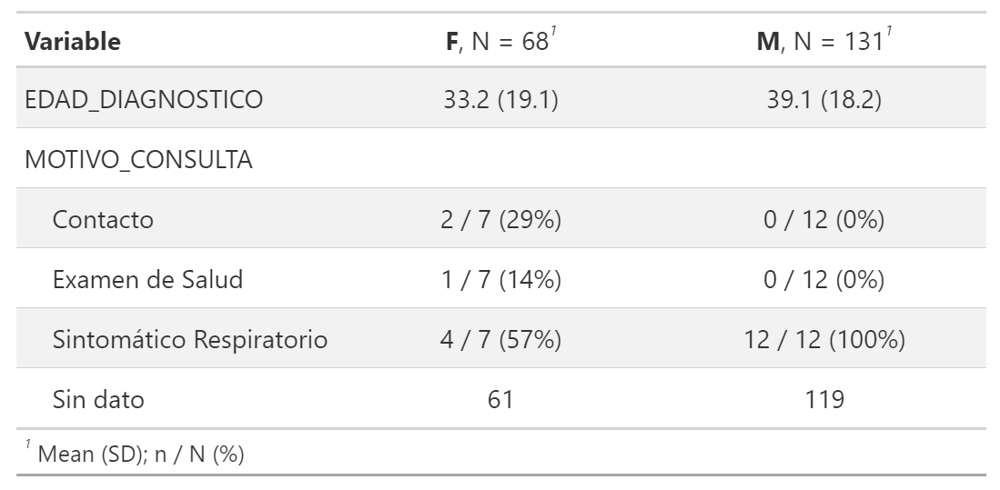{fig-align="center" width="1000"}

## flextable {.title-top}

<br>

Este paquete es similar a otras librerías como **gt**, **huxtable**, **kableExtra**, etc, que transforman las tablas y dataframes de R en salidas elegantes.

. . . 

<br>

La documentación oficial dice *"crear tablas flexibles y altamente personalizables en formatos de Microsoft Word, PowerPoint y HTML".* 

. . . 

<br>
La elección de este paquete sobre las otras opciones tiene que ver con la amplitud de opciones en la compatibilidad de los formatos de salida.

. . .

Las funciones del paquete se integran facilmente con Quarto

## flextable {.title-top}

<br>

Una tablita que creamos anteriormente con `freq_table()` de **rstatix** fue:

```{r}
#| echo: true
#| message: false
#| warning: false


datos |> freq_table(Sexo)

```

<br>

La salida tradicional de consola se visualiza estéticamente fea.

## flextable {.title-top}

Con flextable podemos configurar esa misma tabla, para mejorar su presentación:


```{r}
#| echo: true
#| message: false
#| warning: false

library(flextable)
datos |> freq_table(Sexo) |> 
  flextable() |> 
  fontsize(size = 30, part = "all") |> 
  align(align = "center", part = "all") |> 
  line_spacing(space = 2, part = "all") |> 
  padding(padding = 6, part = "header") |> 
  set_header_labels(n = "Frecuencia", prop = "%") |> 
  theme_zebra()
```

## Estadística inferencial  {.title-top}

<br>

:::: {.columns"}

::: {.column width="70%"}

::: incremental

La **estadística inferencial** es la rama que permite formular conclusiones sobre una población a partir del análisis de una muestra. 

Existen dos actividades principales:

1.  **Estimación de parámetros**: Calcular valores aproximados de parámetros poblacionales desconocidos (ej. prevalencia de una enfermedad).
2.  **Pruebas de hipótesis**: Evaluar afirmaciones sobre uno o más parámetros basándose en evidencia estadística (habitualmente comparaciones).

:::

:::

::: {.column width="30%"}

```{r}
#| echo: false
#| fig-align: center
#| out-width: 60%
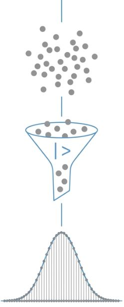
```

:::

::::

## La lógica de la Inferencia {.title-top}

El puente entre lo que observamos y lo que desconocemos.

```{r}
#| echo: false
#| fig-align: center
#| out-width: 80%
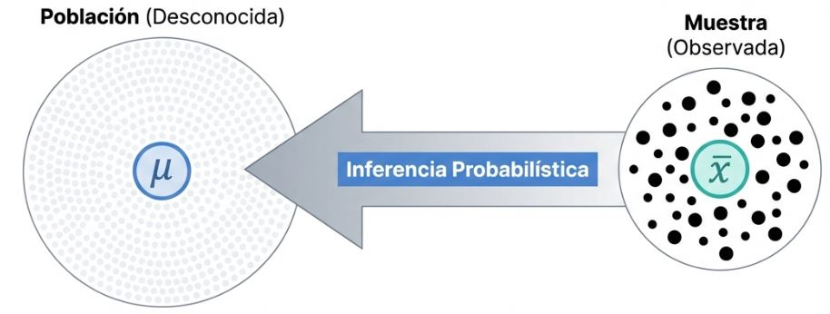
```

**Incertidumbre**: Las conclusiones siempre son *probabilísticas*, nunca absolutas.

## Parámetros vs. Estadísticos {.title-top}

<br>

::: incremental

Es fundamental distinguir entre la población y la muestra:

-   **Parámetros**: Medidas de la población (ej. media poblacional $\mu$).
-   **Estadísticos (o estimadores)**: Medidas obtenidas de la muestra (ej. media muestral $\bar{x}$).

:::

. . .

La **distribución muestral** permite cuantificar la incertidumbre asociada a estas estimaciones. 

Cada tipo diferente de estadístico posee, según su naturaleza, una distribución muestral probabilística teórica que la caracteriza (Normal, Poisson, binomial, etc).

##  Estadístico = variable aleatoria {.title-top}

<br>

::: incremental

- El estadístico es una función de los datos de la muestra.

- Como los datos ($X_1, X_2, ..., X_n$) son variables aleatorias (pues no se sabe qué valores vamos a tener hasta que no conozcamos la muestra), cualquier función de variables aleatorias también es una variable aleatoria.

- Por lo tanto, antes de tomar la muestra, el estadístico tiene una distribución de probabilidad teórica y puede tomar infinitos valores posibles con distintas probabilidades.

:::

## Definiciones {.title-top}

<br>

::: {.fragment .fade-in-then-semi-out}

**Distribución muestral**
La distribución muestral de un estadístico es la distribución de todos los valores posibles que ese estadístico puede tomar al calcularse en muestras aleatorias del mismo tamaño extraídas de una misma población. Este concepto es central en la inferencia estadística, ya que permite cuantificar la incertidumbre asociada a las estimaciones.

:::

::: {.fragment .fade-in-then-semi-out}

**Teoría del muestreo**
Estudio de las técnicas de selección que garantizan la representatividad y permiten cuantificar el error de nuestras estimaciones. Utiliza el azar y el método para analizar la relación entre los estadísticos de la muestra y los parámetros de la población midiendo su incertidumbre. 

:::

## Distribución Normal {.title-top}


:::: {.columns"}

::: {.column width="55%"}

- Es una distribución de probabilidad continua para una variable aleatoria, caracterizada por su forma simétrica de campana.

- La curva es simétrica respecto a su centro.La media, la mediana y la moda coinciden en el mismo valor central.

- Está definida por dos parámetros: la media (determina la ubicación del centro de la distribución) y la varianza o desvío estándar (determina qué tan "ancha" o "delgada" es la campana).


:::

::: {.column width="45%"}

<br>


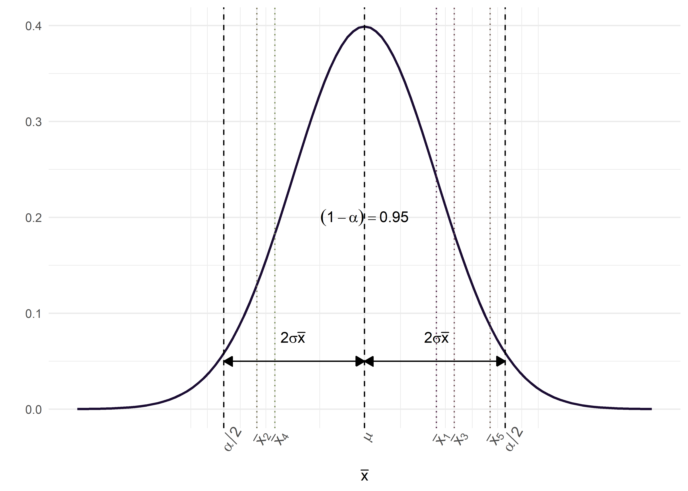{fig-align="center" width="100%"}

:::
::::


## Teorema del Límite Central (TLC) {.title-top}

<br>

::: incremental

- Si se toman muestras aleatorias de tamaño $n$ de cualquier población (incluso no Normal), la distribución de las **medias muestrales** tenderá a seguir una distribución Normal a medida que $n$ aumenta.

- Plantea que la media de los promedios es igual a la media de la población.

- Y que la variabilidad de los promedios (denominada error estándar) disminuye al aumentar el tamaño de la muestra $EE = \frac{\sigma}{\sqrt{n}}$

- Es el "puente" que justifica el uso de tests paramétricos (como el t-test) y el cálculo de intervalos de confianza en muestras que no siguen exactamente una campana de Gauss (en n grandes y con distribuciones no sesgadas)

:::

## Intervalos de Confianza (IC) {.title-top}

El IC proporciona un rango de valores donde se espera encontrar el parámetro poblacional con un cierto nivel de confianza.

$$ IC = \text{estimador puntual} \pm (\text{coef. de confiabilidad}) \times (\text{error estándar}) $$
```{r}
#| echo: false
#| fig-align: center
#| out-width: 40%
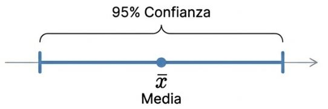
```

IC para la media basado en la distribución Normal

. . .

**Interpretación**: Si repetimos el muestreo **infinitas** veces, el 95% de los intervalos contendrán la media real (parámetro).

## Intervalos de Confianza (IC) {.title-top}

<br>

**Factores que afectan la amplitud del IC**:

- **Nivel de confianza**: A mayor confianza ($1-\alpha$), es decir mayor probabilidad que el parámetro se encuentre en el intervalo, mayor amplitud.
- **Tamaño muestral ($n$)**: Al aumentar $n$, disminuye el error estándar y el IC se vuelve más preciso.

$$EE_{\bar{x}} = \frac{s}{\sqrt{n}}$$

## Intervalos de Confianza (IC) {.title-top}

<br>

- Se pueden calcular IC de distribuciones aproximadas a la Normal mediante el esquema anterior.

- Si la distribucion es sesgada y/o tiene outliers conviene usar la mediana e IC calculados por métodos no paramétricos para conseguir estadísticos robustos.

- Aprovechando la capacidad computacional actual se pueden calcular mediante bootstrap (remuestreo).

## IC en R: Paquete `DescTools` {.title-top}

Aunque no es compatible de forma directa con *tidyverse*, el paquete `DescTools` facilita estos cálculos. Posee funciones para la media y la mediana con métodos ortodoxos y de remuestreo.

```{r, echo=TRUE, eval=FALSE}
library(DescTools)
# Forma básica
MeanCI(base$EDAD_DIAGNOSTICO, conf.level = 0.95)

# Integración con tidyverse
base |> 
  summarise(
    media = mean(EDAD_DIAGNOSTICO),
    ic_lower = MeanCI(EDAD_DIAGNOSTICO)[2],
    ic_upper = MeanCI(EDAD_DIAGNOSTICO)[3]
  )
```

<br>

```{r}
#| echo: false
#| fig-align: center
#| out-width: 30%
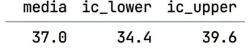
```

## Pruebas de hipótesis {.title-top}

<br>

La prueba de hipótesis es la herramienta que nos permite decidir si lo que vemos en la muestra es lo suficientemente fuerte como para creer que también ocurre en la población. Suele plantearse como una comparación de dos o más grupos y posee una estructura que consta de:

::: {.fragment .fade-in-then-semi-out}

- Hipótesis nula ($H_0$): Afirma que no existe diferencia entre los grupos que se comparan, es decir, que las variaciones observadas se deben únicamente al azar.

:::

::: {.fragment .fade-in-then-semi-out}

- Hipótesis alternativa ($H_1$) : Es la conjetura o suposición que plantea el investigador, estableciendo que sí existe una diferencia entre los grupos. Generalmente es complementaria de la $H_0$

:::

## Pruebas de hipótesis {.title-top}

<br>

::: {.fragment .fade-in-then-semi-out}

- Estadístico de prueba: Es el valor calculado a partir de los datos muestrales que se utiliza para tomar la decisión sobre la $H_0$.

:::

::: {.fragment .fade-in-then-semi-out}

- Valor crítico o Región crítica: La región crítica se establece en función del nivel de significación ($\alpha$) y consiste en el conjunto de valores extremos del estadístico de prueba que, de ser alcanzados, llevarían a rechazar la $H_0$.

::: 

## Regla de decisión {.title-top}

<br>

::: incremental

- Si el valor del estadístico de prueba calculado a partir de la muestra cae en la región crítica, se rechaza la $H_0$ y se concluye que las diferencias observadas **son estadísticamente significativas**.

- Si el valor no cae en la región crítica, no se rechaza la $H_0$; esto indica que las diferencias entre lo observado y lo esperado pueden explicarse por el azar. Es decir, **no son estadísticamente significativas**.

:::

## Pruebas o test paramétricos y no paramétricos {.title-top}

<br>

- **Tests paramétricos**: Asumen que los datos provienen de una población con una distribución específica y se centran en estimar parámetros. Son más "potentes" pero requieren que se cumplan ciertos supuestos. Son sensibles a los datos atípicos.

- **Tests no paramétricos**: No asumen una distribución previa ("distribución libre"). Suelen trabajar con el orden o rangos de los datos en lugar de sus valores exactos. Tienen menor potencia estadística pero no necesitan de cumplimniento de supuestos. Son robustos a datos atípicos. Incluyen a métodos computacionales como el bootstrap.

## Supuestos: Normalidad y homocedasticidad {.title-top}

Antes de cualquier test debemos conocer nuestros datos y como se comportan. Entonces procederemos a validar dos supuestos relevantes a la hora de cumplir con lo requerido por las pruebas paramétricas: la normalidad y la homocedasticidad.

::: {.fragment .fade-in-then-semi-out}

- **Normalidad**: Es el supuesto que los datos de la población de la cual extrajiste la muestra siguen una distribución Normal o aproximada (la famosa Campana de Gauss)

:::

::: {.fragment .fade-in-then-semi-out}

- **Homocedascitidad**: Es el supuesto de que la varianza es constante entre los grupos que comparas.

:::

. . . 

Vamos a usar para esta tarea diagnósticos visuales (gráficos) y analíticos (pruebas de bondad de ajuste).

## Diagnósticos gráficos {.title-top}

<br>

Mediante **Q-Q plots**: gráfico de dispersión que compara los cuantiles observados de tus datos frente a los cuantiles teóricos de una distribución de referencia (Normal).


```{r}
#| echo: false
#| fig-align: center
#| out-width: 60%
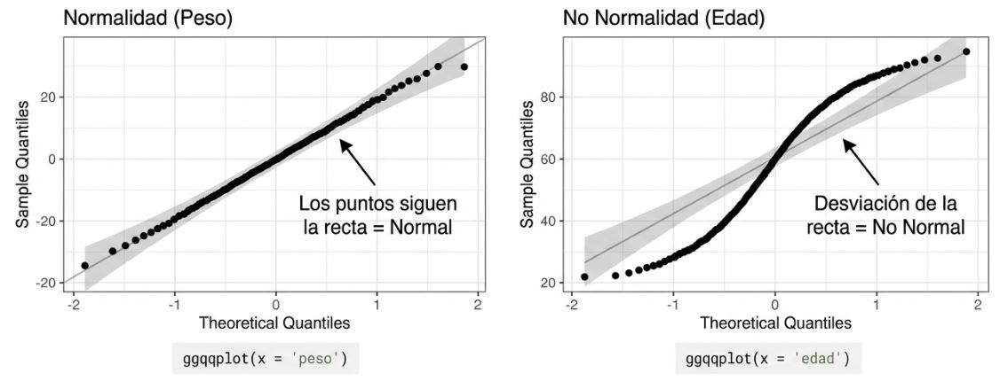
```

Se puede hacer en R mediante paquetes como `dlookr` o `ggpubr`.


## Diagnósticos analíticos {.title-top}

<br>

**Normalidad**

- **Medidas de forma**: Curtosis (kurtosis) y asimetría (skewness).

- **Pruebas de bondad de ajuste**: Test de Shapiro-Wilk (para n ≤ 50) o Lilliefors (para n > 50)

En el lenguaje R podemos usar `kurtosis()` y `skewness()` del paquete **moments**, `shapiro_test()` de **rstatix** y `lillie.test()` de **nortest**.


## Diagnósticos analíticos {.title-top}

<br>

**Homocedasticidad**

:::: {.columns"}

::: {.column width="50%"}

- **F-test**: compara varianzas de 2 grupos

- **Test de Barlett**: compara varianzas en más de 2 grupos

- **Test de Levene**: permite comparar varianzas en grupos que no se aproximan a la distribución normal. 

:::

::: {.column width="50%"}


```{r}
#| echo: false
#| fig-align: center
#| out-width: 60%
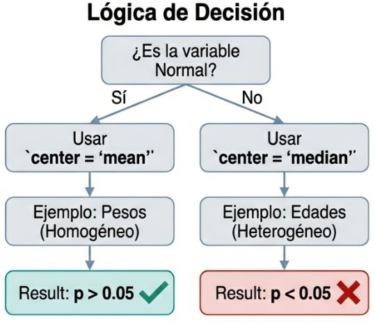
```

:::

::::

## Errores {.title-top}

<br>

```{r}
#| echo: false
#| fig-align: center
#| out-width: 70%
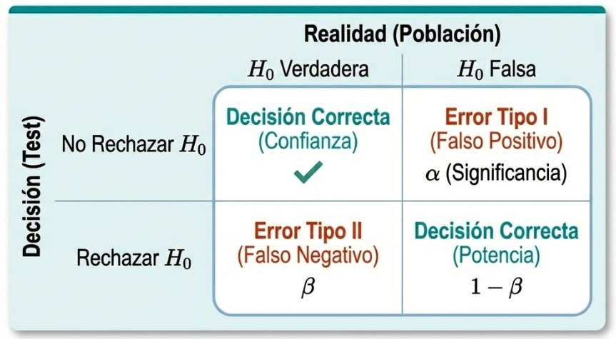
```

## ¿Qué test se debe aplicar en cada caso?

Preguntas que debo responder: 

  - ¿Qué tipo de variable dependiente tengo? 
  - ¿Qué se está comparando?

<br>

```{r}
#| echo: false
#| fig-align: center
#| out-width: 70%
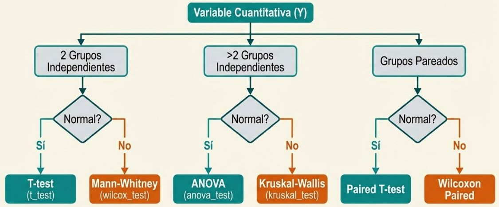
```

## Pruebas paramétricas para datos cuantitativos  {.title-top}

| Prueba                                 | ¿Para qué sirve?                                                |
|----------------------------------------|-----------------------------------------------------------------|
| t de Student (una muestra)             | Comparar la media observada con un valor de referencia.         |
| t de Student (muestras independientes) | Comparar medias entre dos grupos independientes.                |
| t de Student pareada                   | Comparar medias antes-después o en observaciones emparejadas.   |
| Correlación de Pearson                 | Medir asociación lineal entre dos variables cuantitativas.      |


## Pruebas no paramétricas para datos cuantitativos  {.title-top}

| Prueba               | Equivalente paramétrico    | ¿Para qué sirve?                             |
|----------------------|----------------------------|----------------------------------------------|
| Wilcoxon signed-rank | t pareada                  | Comparar dos mediciones relacionadas.        |
| Mann-Whitney U       | t independiente            | Comparar dos grupos independientes.          |
| Spearman             | Pearson                    | Medir asociación monotónica entre variables. |

## Pruebas para datos categóricos  {.title-top}

<br>

**Prueba de $X^2$ (Chi-cuadrado):** Para independencia y bondad de ajuste

**Prueba Exacta de Fisher:** Asociación en tablas de contingencia con frecuencias esperadas bajas.

**Prueba de McNemar:** Comparación de proporciones en muestras apareadas.

**Prueba binomial exacta:** Contraste de una proporción observada frente a una proporción esperada.

**Prueba de tendencia de Cochran-Armitage:** Evaluación de tendencias en variables categóricas ordinales.

## El balance de la inferencia estadística {.title-top}


:::: {.columns"}

::: {.column width="50%"}

Hay 4 elementos que están íntimamente relacionados en este *"juego"* de los test de hipótesis:

- Nivel de significación (Error de tipo I)
- Tamaño de efecto (hay diferentes medidas estandarizadas para cuantificar su magnitud)
- Potencia (Error de tipo II)
- Tamaño de la muestra

El paquete `pwr` en R, incorpora funciones que dados tres de ellos, calcula el cuarto elemento. 

:::

::: {.column width="50%"}

<br>

```{r}
#| echo: false
#| fig-align: center
#| out-width: 80%
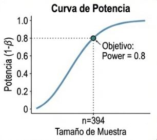
```

:::

::::


## El balance de la inferencia estadística {.title-top}

<br>

| Si aumenta...              | Potencia | Tamaño de muestra necesario | α (Error Tipo I) |
|----------------------------|----------|-----------------------------|------------------|
| Tamaño de efecto           | ↑        | ↓                           | =                |
| Tamaño de muestra          | ↑        | -                           | =                |
| Nivel de significación (α) | ↑        | ↓                           | ↑                |
| Potencia deseada           | -        | ↑                           | =                |


## Funciones de `rstatix` {.title-top}

<br>

Las funciones del paquete `rstatix` tienen una estructura consistente, son compatibles con la filosofía tidyverse y sus nombres son similares al grupo de funciones de R base pero cambian el punto por un guión bajo (así `t.test()` se reemplaza por `t_test()` y `chisq.test()` por `chisq_test()`, por ejemplo). 

Algunos de sus argumentos transversales son:

- `data`: dataframe con el que trabajamos
- `formula`: formula con la relación de variables del input
- `paired`: si los datos son pareados es TRUE
- `var.equal`: si las varianzas son iguales en los grupos es TRUE
- `alternative`: especifica el tipo de hipótesis alternativa ("two.sided", "greater" o "less")

## Sintaxis formula {.title-top}

<br>

La sintaxis `desenlance ~ explicativa` expresa la relación entre variables y es utilizada por la mayoría de las funciones de inferencia y modelado en R, incluyendo funciones de **rstatix**.

```{r, eval=F}
carga_viral ~ sexo     # Comparación de carga viral según categorias de sexo
```

<br>

**Ventajas**

- Sintaxis uniforme en numerosos paquetes y funciones.
- Separa claramente la variable respuesta de las variables explicativas.
- Facilita el ajuste de modelos simples y complejos.

## Sintaxis formula {.title-top}

<br>

| Operador | Significado                                                               | Ejemplo                |
|----------|---------------------------------------------------------------------------|------------------------|
| +        | Agrega variables explicativas al modelo.                                  | y ~ edad + sexo        |
| :        | Incluye únicamente la interacción entre variables.                        | y ~ sexo:tratamiento   |
| *        | Incluye los efectos principales y su interacción (A + B + A:B).           | y ~ sexo * tratamiento |
| -        | Elimina un término del modelo.                                            | y ~ edad + sexo - edad |
| .        | Incluye todas las variables del conjunto de datos (excepto la respuesta). | y ~ .                  |

## Estructuras de control de flujo {.title-top}

<br>

### Bucles tradicionales

- `for()`:  secuencia de elementos

- `while()`:  mientras una condición es verdadera

- `repeat()`:  repetición y control manual con `break` (*uso peligroso*)

<br>

### Mapeo con paquete purrr

- Familia funciones `map()`

## Función `for()` {.title-top}

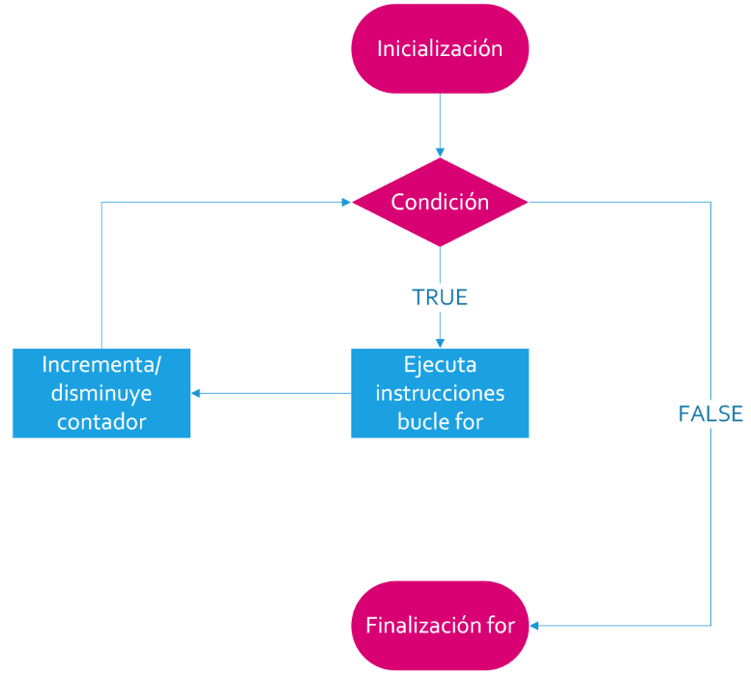{fig-align="center" width="650"}

## Función `for()` {.title-top}

<br>

```{r}
#| eval: false
#| echo: true

for (variable in vector) {
  
}
```

<br>

Donde `variable` se reemplaza por un índice (generalmente `1` pero puede llamarse como deseemos) que recorrerá un `vector` desde 1 a una determinada longitud. (habitualmente `1:length(x)`).

En cada vuelta la `variable` aumenta 1 hasta que alcanza el final del `vector`.

La variable `i` se utiliza en el cuerpo del `for()` para recorrer índices de objetos.


## Función `while()` {.title-top}

{fig-align="center" width="750"}

## Función `while()` {.title-top}

<br>

```{r}
#| eval: false
#| echo: true

while (condition) {
  
}
```

<br>

Donde `condition` es una condición lógica. Si se cumple el bucle continúa, de lo contrario se sale de él.

Dentro del cuerpo de la estructura debemos proceder a manejar los cambios en lo que se evalúa en la condición. Si eso no sucede, el bucle puede llegar a ser infinito.

El control es más "artesanal" que el bucle `for()` y depende completamente del usuario del lenguaje.

## Paquete purrr {.title-top}

<br>

Paquete con herramientas que buscan remplazar las formas tradicionales de bucles iterativos otorgándole compatibilidad con tidy data (datos ordenados).

- Se utiliza para aplicar funciones a vectores, dataframes y listas, dando lugar a la denominada "programación funcional" (FP).

- El paquete se instala y activa con tidyverse.

- Sus funciones son faciles de escribir pero más dificiles de entender para usuarios sin conocimientos de programación.

- Las familia de funciones `map()` son similares en idea que la familia de funciones `apply()` de R base pero consistentes con el ecosistema tidyverse.
 
## Familia `map()`  {.title-top}

<br>

{fig-align="center" width="1100"}