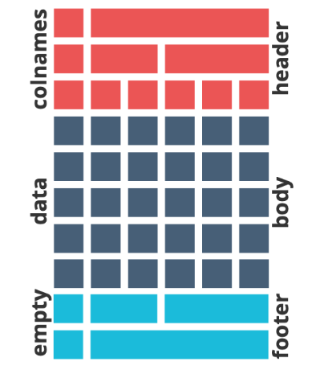
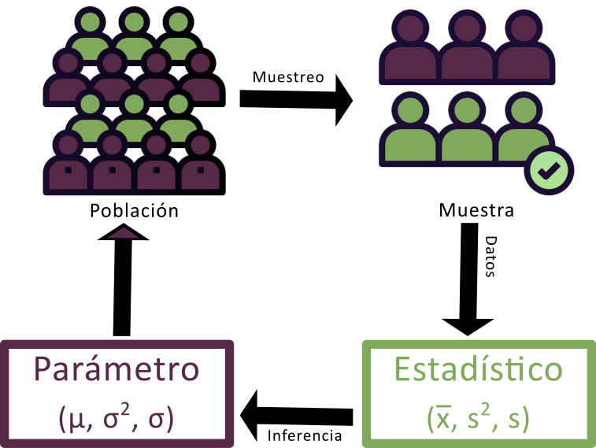

```{r setup, include=FALSE}
knitr::opts_chunk$set(echo = TRUE,
                      message = F,
                      warning = F,
                      fig.align = "center")

pal <- scico::scico(n = 9, palette = "tokyo")

library(kableExtra)

# Formato tabla
kbl_format <- function(x) {
 kbl(x) |> 
  kable_styling(bootstrap_options = c("stripped", "condensed", "hover"),
                fixed_thead = TRUE,
                html_font = "Calibri") |>
  row_spec(0, background = "#2f2e4e", color = "white")
}
```


A partir de las herramientas conocidas hasta el momento sabemos obtener resúmenes estadísticos de variables cuantitativas usando a `summarise()` y estratificados a partir de `group_by()` o el argumento `by =` de  `summarise()`.

Para variables categóricas hemos producido tablas de frecuencias con `count()` y cuando necesitamos cálculos por fila aplicamos operadores simples como la suma o aprovechamos las funciones `rowwise()` y `c_across()`.

En este documento explicaremos como usar otras funciones de paquetes estadísticos para presentar de mejor manera los resultados de la estadística descriptiva y nos introduciremos brevemente en la estadística inferencial.


## Estadísticos compatibles con tidyverse

El interprete de R trae muchas funciones estadísticas descriptivas y para inferencia disponibles en su versión base pero ninguna de estas son compatibles con la filosofía de trabajo de tidyverse. Es por eso que para utilizar funciones como `mean()` o `median()` por ejemplo, debemos introducirlas dentro de estructuras como `summarise()`. Las funciones de este tipo trabajan sobre vectores y no tienen en cuenta a los dataframes que encapsulan a los vectores como variables.

```{r}
#| echo: false
datos <- tibble::tibble(Edad = c(34, 56, 43, 21, 67, 89, 54, 32, 16, 76))
```

Tenemos estos datos y vamos a calcular su media.

```{r}
datos
```
Si lo abordamos con la sintaxis R base:


```{r}
# Edad es una variable de datos pero llamada así es un vector numérico

datos$Edad

# preguntamos si es vector

is.vector(datos$Edad)


# ejecutamos mean() sobre ese vector
mean(datos$Edad)
```

Si lo abordamos con tuberías.

```{r}
#| message: false
#| warning: false
#| error: true

library(tidyverse)
```

```{r}
#| message: false
#| warning: true
#| error: true
datos |> 
  mean(Edad)
```

Necesitamos la función `summarise()` para que funcione bien.

```{r}
datos |> 
  summarise(media_edad = mean(Edad))
```

Dentro de este andamiaje que produce `summarise()` se aplican las funciones estadísticas conocidas del lenguaje como:

-   `min()` mínimo
-   `max()` máximo
-   `mean()` media
-   `median()` mediana
-   `var()` varianza
-   `sd()` desvío
-   `sum()` sumatoria
-   `first()` primer valor en el vector
-   `last()` último valor en el vector
-   `n()` número de valores en el vector
-   `n_distinct()` números de valores distintos en el vector

Y tantas otras provenientes de paquetes específicos como construidas (propias).

Cuando los estadísticos son más complejos que estas funciones descriptivas y devuelven un conjunto de resultados en forma de lista ni siquiera alcanza con aplicarlas dentro de un andamiaje de tidyverse como `summarise()`.

Un ejemplo de ello, son todas las funciones de R base para comparaciones de inferencia. Tomemos el caso de la prueba **t de Student**, que sirve para comparar las medias de variables cuantitativas cuando desconocemos la varianza poblacional.

La función de R base es `t.test()` y sus argumentos obligatorios son `x` e `y` o bien utilizar un formato fórmula (`var1` ~ `var2`) 

Para comparar dos conjuntos de datos con la forma x e y los datos tienen que estar en dos variables separadas y por lo tanto no cumplir con el formato "ordenado".

```{r}
#| echo: false
datos <- tibble::tibble(Edad1 = c(34, 56, 43, 21, 67, 89, 54, 32, 16, 76),
                        Edad2 = c(45, 76, 32, 12, 14, 18, 20, 54, 98, 32))
```

```{r}
datos
```

Aplicamos la función teniendo en cuenta que lo que ingresa en cada argumento es un vector (dataframe$variable)

```{r}
t.test(x = datos$Edad1, y = datos$Edad2)
```
El resultado da un valor de probabilidad de 0,47 lo que indica que no hay diferencias significativas entre las medias de las dos muestras.

Para usar el formato fórmula es necesario que la tabla de datos cumpla con el formato "ordenado", quedando:

```{r}
#| echo: false
datos <- tibble::tibble(Muestra = c(rep(1, 10), rep(2, 10)),
                        Edad = c(34, 56, 43, 21, 67, 89, 54, 32, 16, 76, 45, 76, 32, 12, 14, 18, 20, 54, 98, 32))
```

```{r}
datos
```
En este caso el `t.test()` lleva formula y datos en el argumento data.

```{r}
t.test(formula = Edad ~ Muestra, data = datos)
```

Lo importante acá no es el resultado sino la forma en que lo devuelve. Observaran que no se trata de un formato ordenado ni se parece a una tabla. El tidyverse siempre (salvo raras excepciones, como con `pull()`) devuelve una tabla de datos ordenada y por eso todas estas funciones son incompatibles, aún utilizando un `summarise()` y nos dan error:

```{r}
#| error: true
datos |> 
  summarise(IC = t.test(Edad ~ Muestra))
```
Hace unos años a un desarrollador se le ocurrió crear un paquete que contiene todas estas funciones (y algunas más) del R base ***en espejo*** pero compatibles con tidyverse, esto es: reciben un dataframe y devuelven un dataframe.

El paquete se llama **rstatix** y provee un marco simple e intuitivo compatible con el uso de tuberías, coherente con la filosofía de diseño "tidyverse", para realizar pruebas estadísticas descriptivas básicas y otras más avanzadas de inferencia y modelado.

Las funciones relacionadas con la inferencia estadística, como t-test, ANOVAS, correlaciones y tamaños de efecto, así como también valores p ajustados o agregados de etiquetas de significación no serán explicados en este curso pero aquellxs estudiantes que les interese profundizar y utilizarlas le pueden sacar un provecho muy útil a este paquete, cuyo sitio es <https://rpkgs.datanovia.com/rstatix/index.html>.

Respecto del ejemplo anterior la función de **rstatix** que reemplaza al `t.test()` tradicional es `t_test()`, es decir que al modo tidyverse reemplaza en el nombre el punto por un guión bajo (sucede en todas las funciones del paquete). 

```{r}
#| message: false
#| warning: false
library(rstatix)

datos |> 
  t_test(Edad ~ Muestra, conf.level = .95)
```
Ahora si, el resultado es una tabla de 8 variables por una fila, lo que nos va a permitir poder continuar el trabajo con tuberías. Debajo seleccionamos solo la variable que queremos ver (valor de p).

```{r}
datos |> 
  t_test(Edad ~ Muestra, conf.level = .95) |> 
  select(p)
```

Dentro de los estadísticos descriptivos la función `get_summary_stats()` devuelve un resumen univariado para variables cuantitativas.

```{r}
datos |> 
  get_summary_stats(Edad)
```
Y al ser compatible con tidyverse se puede estratificar con `group_by()`.

```{r}
datos |> 
  group_by(Muestra) |> 
  get_summary_stats(Edad)
```

La función `freq_table()` construye tablas con las variables categóricas.

```{r}
#| echo: false
datos <- tibble::tibble(Sexo = c(rep("Varon", 6), rep("Mujer", 14)),
                        Fuma = c("Si", "No", "No", "Si", "Si", "Si", "No", "No", "Si", "Si", "No", "No", "No", "No", "No", "No", "Si", "No", "Si", "No"))
```

```{r}
datos |> 
 freq_table(Sexo)
```
También agregando otra variables que estratifiquen la salida.

```{r}
datos |> 
 freq_table(Sexo, Fuma)
```

Una opción más completa para construir tablas y tablas de contingencia es usar la familia de funciones `tabyl()` del paquete **janitor**.

```{r}
#| message: false
#| warning: false
library(janitor)

datos |> 
  tabyl(Sexo)
```


Calcula las frecuencias absolutas y relativas de variables categóricas de forma similar a `freq_table()` pero se le pueden modificar sus argumentos y asociar otras funciones del paquete mediante tuberías para obtener mejores resultados (también es compatible con tidyverse).

```{r}
datos |>  
  tabyl(Sexo) |> 
  adorn_totals(where = "row") %>% # agregamos totales 
  adorn_pct_formatting(digits = 2) # porcentaje con dos decimales
```

La forma más adecuada de describir la relación entre dos variables categóricas es a partir de la construcción de una tabla de contingencia. Para ello se introduce en cada fila de la tabla las categorías de una de las variables y las categorías de la otra variable se asocian a cada una de las columnas de la tabla, en cada celda de la tabla aparecerá el número de observaciones correspondientes a la combinación oportuna de ambas variables. Si bien `freq_table()` hace lo mismo, respeta la salida ordenada lo que dificulta su lectura.

Con la misma función `tabyl()` se puede realizar una tabla de contingencia, incluyendo a la variable Fuma. 

```{r}
datos  |>   
  tabyl(Sexo, Fuma) 
```

Recordemos que el orden dentro de los paréntesis de la función es igual al de los índices del lenguage, el primer argumento es la variable que aparecerá en las filas y el segundo la variable de las columnas. Por ese motivo, en la tabla de contingencia absoluta tenemos el Sexo en las filas y a Fuma en las columnas.

Su salida se puede mejorar con totales por columna y que aparezca el nombre de la variable que esta en la columna:

```{r}
datos  |>   
  tabyl(Sexo, Fuma) |> 
  adorn_title(placement = "combined") |> 
  adorn_totals(where = "row")
```

También haciendo que los valores sean porcentuales por fila.

```{r}
datos  |>   
  tabyl(Sexo, Fuma) |>  
  adorn_title(placement = "combined") |> 
  adorn_totals(where = "row") |>  
  adorn_percentages(denominator = "row") |>  #  % por fila
  adorn_pct_formatting(digits = 2) # redondea con 2 decimales
```

Incorporamos valores absolutos entre paréntesis.

```{r}
datos  |>   
  tabyl(Sexo, Fuma) |>  
  adorn_totals(where = "row") |>  
  adorn_percentages(denominator = "row") |>  
  adorn_pct_formatting(digits = 2) |> 
  adorn_ns() |> 
  adorn_title() 
```

El paquete trae muchas funciones que se integran para construir tablas complejas. Más de estas opciones las pueden encontrar en el sitio oficial del paquete [janitor](https://sfirke.github.io/janitor/)

## Tablas para presentaciones

Cuando necesitemos presentar resultados estadísticos combinados, producto de variables cuanti y cualitativas a la vez, podemos hechar mano a funciones del paquete **gtsummary**.

{fig-align="center" width="100"}

Esta librería proporciona una forma elegante y flexible de crear tablas analíticas y de resumen, univariadas, estratificadas y complejas.

Integra estimaciones estadísticas predefinidas y se pueden personalizar a gusto, interactuando con otros paquetes como **gt**, **labelled** y **flextable**.

En el sitio del desarrollador [(gtsummary)](https://www.danieldsjoberg.com/gtsummary/), encontrarán mucha documentación para adecuar los requerimientos de la salida buscada.

Mostramos un ejemplo en función de los datos del archivo "base2023r.xlsx". 

```{r}
#| message: false
#| warning: false

library(readxl)
library(gtsummary)


datos <- read_excel("datos/base2023r.xlsx")


datos |> 
  select(EDAD_DIAGNOSTICO, SEXO, MOTIVO_CONSULTA) |>
  tbl_summary()
```
Quizás lo mejor sea presentar los datos estratificados por sexo, por ejmplo. Además configuramos algunos argumentos mas.

```{r}
datos |> 
  select(EDAD_DIAGNOSTICO, SEXO, MOTIVO_CONSULTA) |>
  filter(SEXO != "A") |> 
  tbl_summary(by = SEXO,
              statistic = list(
                all_continuous() ~ "{mean} ({sd})",
                all_categorical() ~ "{n} / {N} ({p}%)"),
              digits = all_continuous() ~ 1,
              missing_text = "Sin dato") |> 
  modify_header(label ~ "**Variable**")
```

El argumento `statistic` permite que, mediante una lista, configuremos los estadísticos a presentar. Para todas las variables continuas seleccionamos la media (mean) y el desvío estándar (sd); para todas las variables categóricas el conteo de cada categoría y el porcentaje. Los decimales de las variables continuas quedan definidos en 1 y cuando aparezcan valores NA serán expresados con la etiqueta "Sin dato". Por último, la cabecera de la tabla en la comuna de las variables será "Variable" en negrita.

### Flextable

{fig-align="center" width="100"}

Estas tablas de presentación de resultados se pueden conectar con el paquete **flextable** para exportarlas en diferentes formatos, como *Word, html, PDF, PowerPoint* o *imagen* y además se vincula con el contenido en estructuras de archivos **rmarkdown** y/o **Quarto**.

Una salida interesante es poder guardar la tabla en formato **Word** (.docx), porque luego podemos editarla facilmente, para esto la función `as_flex_table()` convierte al `tbl_summary()` de **gtsummary** en clase flextable.

```{r}
#| message: false
#| warning: false

library(flextable)

tabla1 <- datos |> 
  select(EDAD_DIAGNOSTICO, SEXO, MOTIVO_CONSULTA) |>
  filter(SEXO != "A") |> 
  tbl_summary(by = SEXO,
              statistic = list(
                all_continuous() ~ "{mean} ({sd})",
                all_categorical() ~ "{n} / {N} ({p}%)"),
              digits = all_continuous() ~ 1,
              missing_text = "Sin dato") |> 
  modify_header(label ~ "**Variable**") |> 
  as_flex_table() |> 
  autofit() |>    # ajuste automático 
  theme_box()     # tema box
```

Luego es posible exportar fácilmente una o más tablas a partir de los objetos flextables almacenados a documentos tipo html, RTF, Word, PowerPoint o PNG.

Un ejemplo para salidas tipo Word es: `save_as_docx()`

```{r}
#| eval: false
save_as_docx(
  "tabla 1" = tabla1, 
  path = "/resultados/tabla_exportada.docx")
```

Exporta el objeto *tabla1* en el archivo **tabla_exportada.docx** dentro de la carpeta *resultados*. 

Todos los objetos de clase *flextable* están compuestos por tres partes:

- **header**: de forma predeterminada, solo hay una fila de encabezado que contiene los nombres del dataframe.  
- **body**: la parte del cuerpo contiene datos del dataframe.
- **footer**: la parte del pie de tabla no está implementada de forma predeterminada, pero puede contener notas al pie o cualquier contenido.

{fig-align="center" width="300"}


## Estadística inferencial

La **estadística inferencial** es la rama de la estadística que permite formular conclusiones sobre una población a partir del análisis de una muestra. Se apoya en el cálculo de probabilidades, que proporciona el marco teórico para modelar fenómenos aleatorios y generalizar los resultados muestrales a toda la población. Dado que las inferencias basadas en muestras están sujetas a incertidumbre, es fundamental expresarlas siempre en términos **probabilísticos**.

Las dos actividades principales en este proceso son:

-   **Estimación de parámetros**: consiste en calcular, a partir de los datos muestrales, valores que aproximen parámetros desconocidos de la población.

    -   *Ejemplo: Estimar la prevalencia de una enfermedad X en la población.*

-   **Pruebas de hipótesis**: implica evaluar con base estadística afirmaciones acerca de uno o más parámetros.\
    *Ejemplos:*

    -   *¿La prevalencia de la enfermedad X en Argentina es menor que en Uruguay?*

    -   *¿La prevalencia de la enfermedad X en Argentina en 2010 fue menor que en el año 2000?*

Al trabajar con muestras, entra en juego el concepto de **teoría del muestreo**, que, si bien no abordaremos en profundidad aquí, es clave para comprender cómo se relacionan los valores observados en la muestra con los de la población.

Esta teoría estudia la relación entre la distribución de una variable en la población y el comportamiento de dicha variable en muestras aleatorias extraídas de ella. A las medidas obtenidas a partir de la muestra se las denomina **estadísticos muestrales** o simplemente *estadísticos*, mientras que sus contrapartes en la población se denominan **parámetros**.

Por ejemplo, supongamos que queremos conocer el valor medio de colesterol total de la población de Mar del Plata y tomamos una muestra de tamaño $n$.

-   La media poblacional del colesterol total se representa con la letra griega $\mu$ y corresponde al **parámetro**.

-   La media muestral, que se obtiene a partir de los datos de la muestra, se representa como $\bar{x}$ y es un **estimador** o estadístico muestral. 

{fig-align="center" width=75%}

La **distribución muestral de un estadístico** es la distribución de todos los valores posibles que ese estadístico puede tomar al calcularse en muestras aleatorias del mismo tamaño extraídas de una misma población. Este concepto es central en la inferencia estadística, ya que permite cuantificar la incertidumbre asociada a las estimaciones.

Como construir una distribución muestral puede resultar muy laborioso cuando la población es grande, y directamente imposible si es infinita, se suelen utilizar aproximaciones basadas en la toma de un gran número de muestras aleatorias del mismo tamaño.

## Intervalos de Confianza (IC)

Una forma eficaz de abordar la inferencia estadística es a través de los **intervalos de confianza (IC)**, ya que, aunque son procedimientos inferenciales, están estrechamente vinculados con la estadística descriptiva.

Supongamos que queremos estimar la **media de colesterol** de la población de Mar del Plata. Sería inviable medir el colesterol de cada habitante, por lo que optamos por tomar una muestra de, por ejemplo, 100, 200 o 300 individuos (más adelante veremos cómo determinar el tamaño adecuado de la muestra). Debemos recordar que diferentes muestras producirán en general medias diferentes. Existe, por tanto, un grado de incertidumbre asociado. Si hiciéramos una estimación puntual, obtendríamos un solo valor, pero sin información sobre su variabilidad. No sabríamos qué tan cerca o lejos está nuestra estimación ($\bar{x}$) de la verdadera media poblacional ($\mu$).

El **intervalo de confianza** proporciona un rango de valores dentro del cual se espera que se encuentre el valor verdadero del parámetro poblacional, con un cierto nivel de confianza. A diferencia de la estimación puntual que proporciona un único valor numérico, el intervalo consta de dos valores entre los cuales se supone está contenido el parámetro estimado. Entonces, el intervalo de confianza puede expresarse como:

$$ IC = estimador~puntual \pm (coeficiente~de~confiabilidad) * (error~ estandar) $$

donde:

-   **Estimador puntual**:

    -   Para la media poblacional ($\mu$), se toma la media muestral($\bar{x}$).

    -   Para una proporción de la población ($p$), se toma la proporción muestral ($\hat{p}$).

-   **Coeficiente de confiabilidad:** Se relaciona con el nivel de confianza deseado (por ejemplo, 90%, 95% o 99%), y se expresa como $1 - \alpha$, es decir la probabilidad de que el parámetro se encuentre dentro del IC. Recordemos que el nivel de significancia ($\alpha$) es la probabilidad de que el parámetro no se halle dentro del IC y es un valor generalmente pequeño (por ejemplo, 0.1, 0.05 o 0.01) expresado como probabilidad o porcentaje (por ejemplo, 10%, 5% o 1%).

-   **Error estándar (SE):** Representa la variabilidad de la distribución muestral. Por ejemplo, para la media el error estándar se calcula como la raíz cuadrada de la varianza de la distribución muestral:

    $$ 
    SE = \frac{\sigma}{\sqrt{n}} 
    $$

    Donde $\sigma$ es la desviación estándar poblacional y $n$ el tamaño de la muestra. Si se estima un IC para una proporción, el error estándar es:

    $$ 
    SE = \sqrt{\frac{\hat{p}(1 - \hat{p})}{n}} 
    $$

El proceso se fundamenta en el Teorema del Límite Central (TCL), que establece que, para muestras suficientemente grandes, la distribución de $\bar{x}$ es aproximadamente normal, con media $\mu$ y varianza $\sigma^2/n$. Así, la variable tipificada:

$$ 
Z = \frac{\bar{x}-\mu}{\sigma} 
$$

sigue una distribución normal estándar (media 0 y desviación estándar 1), lo que permite calcular probabilidades y construir el IC.

En cualquier distribución normal:

-   Entre $\mu \pm \sigma$ se encuentra el 68% de los datos.

-   Entre $\mu \pm 2\sigma$ se encuentra el 95%.

-   Entre $\mu \pm 3\sigma$ se encuentra el 99%.

El siguiente gráfico ilustra lo explicado anteriormente:

```{r}
#| echo: false 
# Define región crítica 
crit_n <- limitRange <- function(fun, min, max) {   
  function(x) {     
    y <- fun(x)     
    y[x < min  |  x > max] <- NA     
    return(y)   
  }}  

# Gráfico base 
g1 <- tibble(x = c(-4, 4)) |>    
  
  # plot     
  ggplot(mapping = aes(x = x)) +      
  # curva normal  
  stat_function(fun = dnorm, linewidth = .8, color = pal[1]) +      
  # Región crítica 95%   
  geom_vline(xintercept = -1.96, lty = 2) +      
  geom_vline(xintercept = 1.96, lty = 2) +      
  # Tema   
  theme_minimal() +    
  theme(axis.text.x = element_text(face = "bold",                                     size = 11,                                    
                                   angle = 60))  
## Gráfico región crítica 
g1 +   
  # Sombreado   
  stat_function(fun = crit_n(dnorm, min = -1, max = 1),     
                geom = "area",      
                fill = pal[2],     
                alpha = 0.4) +      
  
  # Región crítica 68%   
  annotate(geom = "text",            
           label = "68%",            
           x = 0, y = .2) +      
  geom_vline(xintercept = -1, lty = 2) +      
  geom_vline(xintercept = 1, lty = 2) +     
  
  # Región crítica 95%    
  annotate(geom = "text",            
           label = "95%",            
           x = 0, y = .475) +      
  
  annotate("segment", x = -1.96, xend = 1.96, y = .45,     
           arrow = arrow(type = "closed",                    
                         ends = "both",                   
                         length = unit(.1, "inches"))) +    
  
  # Región crítica 99%   
  annotate(geom = "text",            
           label = "99%",            
           x = 0, y = .55) +      
  annotate("segment", x = -2.58, xend = 2.58, y = .525,      
           arrow = arrow(type = "closed",                   
                         ends = "both",                   
                         length = unit(.1, "inches"))) +
  
  geom_vline(xintercept = -2.58, lty = 2) +     
  geom_vline(xintercept = 2.58, lty = 2) +      
  
  # Etiquetas   
  scale_x_continuous(breaks = c(-Inf, -2.58, -1.96, -1,                                  0, 1, 1.96, 2.58, Inf),                     
                     labels = c("",                                 
                                expression(mu - 2.58 * sigma),  
                                expression(mu - 1.96 * sigma),  
                                expression(mu - sigma),           
                                expression(mu),           
                                expression(mu + sigma),       
                                expression(mu + 1.96 * sigma),                                 
                                expression(mu + 2.58 * sigma),  
                                "")) +     
  # Títulos   
  labs(x = "", y = "")
```

Sabemos que, independientemente de la localización de los valores, aproximadamente el **95%** de los valores posibles de $\bar{x}$ en la distribución muestral estarán a menos de dos desviaciones estándar de la media $\mu$. Es decir, el intervalo $\mu \pm 2\sigma$ contendrá el **95%** de los valores posibles de $\bar{x}$.

Supongamos que formamos intervalos a partir de todos los posibles valores de $\bar{x}$, calculados a partir de todas las muestras posibles de tamaño $n$ tomadas de la población de interés. Esto generará una gran cantidad de intervalos de la forma $\mu \pm  2\sigma$, todos con la misma amplitud, centrados en torno a una $\mu$ desconocida.

Aproximadamente el **95%** de estos intervalos tendrán sus centros dentro del intervalo $\mu \pm  2\sigma$. Cada uno de estos intervalos, que se encuentran dentro de $\mu \pm  2\sigma$, puede contener el valor verdadero de $\mu$.

### ¿Cómo se interpreta un IC?

Si hubiésemos tomado múltiples muestras del mismo tamaño de la población, en al menos $100 * (1 − \alpha)\%$ de las ocasiones el intervalo calculado contendría el parámetro poblacional real. Es decir, un IC al 95% implica que, a largo plazo, el 95% de los intervalos obtenidos a partir de muestras repetidas incluirán el valor verdadero del parámetro.

El producto del coeficiente de confiabilidad y el error estándar se denomina **precisión de la estimación** y es el componente responsable de la amplitud del IC. Recordemos que la fórmula general para construir un intervalo de confianza era:

$$ IC = estimador~puntual \pm (coeficiente~de~confiabilidad) * (error~ estandar) $$

Para el caso de la media:

-   **Aumento de la confiabilidad:** Si se incrementa el nivel de confianza, el coeficiente (por ejemplo, pasando de 1.96 a un valor mayor) aumenta, lo que a su vez incrementa la amplitud del IC.

-   **Reducción del error estándar:** Si se fija la confiabilidad (por ejemplo, al 95%), para disminuir la amplitud del IC es necesario reducir el error estándar. Dado que el error estándar de la media es:

    $$ SE = \frac{\sigma}{\sqrt{n}} $$

    y considerando que $\sigma$ es constante, la única forma de disminuir el error estándar es aumentando el tamaño muestral ($n$).

Surge entonces la pregunta: **¿qué tan grande debe ser** $n$?\
La respuesta dependerá de $\sigma$, del nivel de significación ($\alpha$) y de la amplitud deseada para el IC. La relación es:

$$ Amplitud = Z \frac{\sigma}{\sqrt{n}} \Longrightarrow n = \frac{Z^2\sigma^2}{Amplitud^2} \quad (Z = 1.96~si~\alpha = 0.05) $$

(En la práctica, $\sigma$ generalmente no se conoce, así que se usa su estimación muestral).

La expresión del error estándar varía según el parámetro a estimar. Hemos visto el caso de la media; si lo que se desea es calcular un IC para una proporción, recordemos que, para muestras grandes, la distribución de las proporciones de la muestra es aproximadamente normal de acuerdo con el TCL. En este caso:

-   La media de la distribución es la proporción real $p$

-   La varianza es $p(1-p)/n$, lo que nos lleva a que el error estándar es:

$$ 
SE = \sqrt{\frac{\hat{p}(1-\hat{p})}{n}}      
$$

y el IC para la proporción se expresa como:

$$ \hat{p} - Z_{1-\alpha/2}\sqrt{\frac{\hat{p}(1-\hat{p})}{n}} < p < \hat{p} + Z_{1-\alpha/2}\sqrt{\frac{\hat{p}(1-\hat{p})}{n}}  $$

Dado que un intervalo de confianza implica una declaración probabilística, su cálculo se fundamenta en las distribuciones muestrales de los estimadores y en el correspondiente error estándar. Aunque las fórmulas pueden parecer complejas, los paquetes estadísticos (como R) realizan estos cálculos automáticamente. Lo fundamental es comprender en qué depende la amplitud del IC (nivel de confianza, error estándar y tamaño muestral) y cómo cada uno de estos componentes influye en la precisión de la estimación.

Para profundizar y visualizar simulaciones sobre estos conceptos, pueden explorar recursos interactivos como:

➡️ [**Viendo la teoría: Una introducción visual a probabilidad y estadística**](https://seeing-theory.brown.edu/frequentist-inference/es.html#section2)


En el lenguaje R, además de calcular los intervalos de confianza por fórmula o mediante métodos bootstrap, existen varios paquetes que contemplan funciones ya creadas. Uno de ellos se denomina **DescTools** (su sitio en <https://andrisignorell.github.io/DescTools/>), que entre sus variadas funciones posee a un grupo con nombres finalizados en **CI**, para el cálculo de los intervalos de confianza, como **MeanCI()** para IC de medias, **MedianCI()** para IC de medianas, **BinomCI()** para IC de proporciones binomiales, etc 

```{r}
#| message: false
#| warning: false
#| echo: false

library(readxl)
library(tidyverse)
library(DescTools)


base <- read_excel("datos/base2023r.xlsx")
```

Estas funciones no son compatibles con tidyverse y pueden ejecutarse a la forma básica de R:

```{r}
MeanCI(base$EDAD_DIAGNOSTICO)
```
Por defecto, el intervalo de confianza es del 95%, pero podemos cambiarlo mediante el argumento **conf.level**.

```{r}
MeanCI(base$EDAD_DIAGNOSTICO, conf.level = 0.99)
```
Una forma de implementarla dentro de una estructura tidyverse es:

```{r}
base |> 
  summarise(
    media = mean(EDAD_DIAGNOSTICO),
    ic_lower = MeanCI(base$EDAD_DIAGNOSTICO)[2],
    ic_upper = MeanCI(base$EDAD_DIAGNOSTICO)[3]
  )
```

Situaciones similares se dan en las otras funciones del mismo paquete para cálculo de intervalos de confianza de diferentes estimadores. 

## Normalidad y homocedasticidad

Las características fundamentales a la hora de decidir si utilizaremos métodos paramétricos o no paramétricos para la inferencia estadística, es que los datos se aproximen a una distribución *normal* y conocer si tienen una dispersión homogénea o heterogénea. 

## Normalidad

Determinar que una distribución es aproximadamente normal nos permite decidirnos por test de comparaciones paramétricos.

Existen tres enfoques que debemos analizar simultáneamente:

-   Métodos gráficos
-   Métodos analíticos
-   Pruebas de bondad de ajuste

### Métodos gráficos

El gráfico por excelencia para evaluar normalidad es el Q-Q Plot que consiste en comparar los cuantiles de la distribución observada con los cuantiles teóricos de una distribución normal con la misma media y desviación estándar que los datos.

Cuanto más se aproximen los datos a una normal, más alineados están los puntos entorno a la recta.

En el lenguaje R hay varios paquetes que tienen funciones para construirlos. Vamos a mostrar algunos interesantes y para esto importaremos algunos datos simulados:

```{r}
datos <- read_csv2("datos/normalidad.csv")
```

Una evaluación gráfica de normalidad rápida la podemos conseguir usando la función `plot_normality()` del paquete `dlookr`:

```{r}
library(dlookr)

datos |> 
  plot_normality(peso) 
```

A simple vista observamos que los puntos de la variable `peso` *se ajustan bastante bien a la recta*.

La gráfica trae además de un histograma de los valores de la variable, dos más con transformaciones estándares de logaritmo y raíz cuadrada.

Esta situación se presenta dado que en algunas situaciones permiten que los datos se aproximen a la distribución normal y podamos utilizar métodos paramétricos.

La función `ggqqplot()` del paquete `ggpubr` [@ggpubr] nos permite agregar intervalos de confianza (zona gris alrededor de la recta) que nos orienta mejor sobre "donde caen" los puntos de la variable analizada:

```{r}
library(ggpubr)

datos |>  
  ggqqplot(x = "peso")
```

Un ejemplo donde la variable parece no cumplir con el supuesto de normalidad en estos datos de prueba es `edad`:

```{r}
datos |> 
  ggqqplot(x = "edad")
```

Vemos claramente que los puntos de los quantiles se salen de la línea teórica y su zona de confianza y parecen tener otra distribución diferente a la normal.  

### Métodos analíticos

#### Medidas de forma

Existen dos medidas de forma útiles que podemos calcular mediante funciones de R.

-   La curtosis (kurtosis)
-   La asimetría (skewness)

La curtosis mide el grado de agudeza o achatamiento de una distribución con relación a la distribución normal.

-   \< 0 Distribución platicúrtica (apuntamiento negativo): baja concentración de valores
-   \> 0 Distribución leptocúrtica (apuntamiento positivo): gran concentración de valores
-   = 0 Distribución mesocúrtica (apuntamiento normal): concentración como en la distribución normal.

El paquete `moments` [@moments] posee algunas funciones interesantes para analizar medidas de forma, como el estimador de Pearson para curtosis:

```{r}
library(moments)

datos |> 
  summarise(kurtosis_edad = kurtosis(edad, na.rm = T),
            kurtosis_peso = kurtosis(peso, na.rm = T))
```

En los dos casos estamos frente a una *distribución leptocúrtica* pero de magnitudes bien diferentes. Muy alta en el caso de la variable `edad` (8,0) y mucho menor para la variable `peso` (2,7).

El índice de asimetría es un indicador que permite establecer el *grado de asimetría* que presenta una distribución. Los valores menores que 0 indican distribución asimétrica negativa; los mayores a 0: distribución asimetrica positiva y cuando sea 0, o muy próximo a 0, distribución simétrica:

```{r}
datos |>  
  summarise(asimetria_edad = skewness(edad, na.rm = T),
            asimetria_peso = skewness(peso, na.rm = T))
```

Los valores obtenidos con la función `skewness()` del paquete `moments` nos informan que la distribución de la edad tienen una asimetría positiva (2,2) y que los valores de peso se distribuyen bastante simétricos (0,1).

Estas características de las distribuciones también se pueden ver mediante histogramas o gráficos de densidad:

```{r}
datos  |>  
  plot_normality(edad, col = "forestgreen") 

datos |> 
  plot_normality(peso, col = "royalblue") 
```

Los histogramas que se acerquen a la clásica "campana de Gauss" tendrán curtosis y asimetrías alrededor del valor cero.

### Pruebas de bondad de ajuste

Una prueba de bondad de ajuste permite testear la hipótesis de que una variable aleatoria sigue cierta distribución de probabilidad y se utiliza en situaciones donde se requiere comparar una distribución observada con una teórica o hipotética.

El mecanismo es idéntico a cualquier test de hipótesis salvo que aquí esperamos no descartar la hipótesis nula de igualdad, por lo que obtener valores *p* de probabilidad mayores a 0,05 es signo de que la distribución de la variable analizada se ajusta bien.

A continuación, presentaremos los test de hipótesis más utilizados para analizar normalidad.

#### Test de Shapiro-Wilk

Lleva el nombre de sus [autores](https://es.wikipedia.org/wiki/Test_de_Shapiro%E2%80%93Wilk) (Samuel Shapiro y Martin Wilk) y es usado preferentemente para muestras de hasta 50 observaciones.

La función se encuentra desarrollada en el paquete `stats`, se llama `shapiro.test()` y utiliza sintaxis R base:

```{r}
shapiro.test(datos$edad)

shapiro.test(datos$peso)
```

**Interpretación**: Siendo la hipótesis nula que la población está distribuida normalmente, si el p-valor es menor a $\alpha$ (nivel de significancia, convencionalmente un 0,05) entonces la hipótesis nula es rechazada (se concluye que los datos no provienen de una distribución normal). Si el p-valor es mayor a $\alpha$, se concluye que no se puede rechazar dicha hipótesis.

En función de esta interpretación (que es común a todos los test de hipótesis de normalidad), podemos decir que la distribución de la variable **edad** *no se ajusta a la normal* y no podemos rechazar que la distribución de la variable **peso** se ajuste.

#### Test de Kolmogorov-Smirnov

El test de [**Kolmogorov-Smirnov**](https://es.wikipedia.org/wiki/Prueba_de_Kolmogorov-Smirnov) permite estudiar si una muestra procede de una población con una determinada distribución que no está limitado únicamente a la distribución normal.

El test asume que se conoce la media y varianza poblacional, lo que en la mayoría de los casos no es posible. Para resolver este problema, se realizó una modificación conocida como test Lilliefors.

#### Test de Lilliefors

El test de [**Lilliefors**](https://es.wikipedia.org/wiki/Prueba_de_Lilliefors) asume que la media y varianza son desconocidas y está especialmente desarrollado para contrastar la normalidad.

Es la alternativa al test de Shapiro-Wilk recomendada cuando el número de observaciones es mayor de 50.

La función `lillie.test()` del paquete `nortest` [@nortest] permite aplicarlo:

```{r}
library(nortest)

lillie.test(datos$edad)

lillie.test(datos$peso)
```

Los resultados son coincidentes con los obtenidos anteriormente.

#### Test de D'agostino

Esta prueba se basa en las transformaciones de la curtosis y la asimetría de la muestra, y solo tiene poder frente a las alternativas de que la distribución sea sesgada.

El paquete `moments` la tiene implementada en `agostino.test()`:

```{r}
agostino.test(datos$edad)

agostino.test(datos$peso)
```

Los resultados coinciden con la observación de asimetría que efectuamos con los métodos analíticos, confirmando que la variable `edad` *no se ajusta* a una curva simétrica y la variable `peso` si lo hace.

Cuando estos test se emplean con la finalidad de verificar las condiciones de métodos paramétricos es importante tener en cuenta que, al tratarse de valores probabilidad, cuanto mayor sea el tamaño de la muestra más poder estadístico tienen y más fácil es encontrar evidencias en contra de la hipótesis nula de normalidad.

Por otra parte, cuanto mayor sea el tamaño de la muestra, menos sensibles son los métodos paramétricos a la falta de normalidad. Por esta razón, es importante no basar las conclusiones únicamente en los resultados de los test, sino también considerar los otros métodos (gráfico y analítico) y no olvidar el tamaño de la muestra.

## Homocedasticidad

La homogeneidad de varianzas es un supuesto que considera constante la varianza en los distintos grupos que queremos comparar.

Esta homogeneidad es condición necesaria antes de aplicar algunos test de hipótesis de comparaciones o bien para aplicar correcciones mediante los argumentos de las funciones de R.

Existen diferentes test de bondad de ajuste que permiten evaluar la distribución de la varianza. Todos ellos consideran como $H_0$ que la varianza es igual entre los grupos y como $H_1$ que no lo es.

La diferencia entre ellos es el estadístico de centralidad que utilizan:

-   Media de la varianza: son los más potentes pero se aplican en distribuciones que se aproximan a la normal.

-   Mediana de la varianza: son menos potentes pero consiguen mejores resultados en distribuciones asimétricas.

### F-test

Este test es un contraste de la razón de varianzas, mediante el estadístico F que sigue una distribución F-Snedecor.

Se utiliza cuando las distribuciones se aproximan a la "normal" y en R base se la encuentra en la función `var.test()`, incluida en R base, que permite utilizar la sintaxis de fórmula:

```{r}
#| eval: false
variable_cuantitativa ~ variable_categórica_grupos
```

Por ejemplo:

```{r}
var.test(formula = peso ~ sexo, data = datos)
```

Comparamos las varianzas de la variable peso entre el grupo de mujeres y hombres. El valor $p$ del test indica que no podemos descartar la igualdad de varianzas entre los grupos ($H_0$) o lo que es lo mismo el test no encuentra diferencias significativas entre las varianzas de los dos grupos.

### Test de Bartlett

Este test se puede utilizar como alternativa al F-test, sobre todo porque nos permite aplicarlo también cuando tenemos *más de 2 grupos de comparación*. Al igual que el anterior es sensible a las desviaciones de la normalidad.

La función en R `base` es `bartlett.test()` y también se pueden usar argumentos tipo fórmula:

```{r}
bartlett.test(formula = peso ~ sexo, data = datos)
```

El resultado es coincidente con el mostrado por `var.test()`. No se encuentran diferencias significativas entres las varianzas de los pesos en los dos grupos (Mujer - Varon)

### Test de Levene

El test de Levene sirve para comparar la varianza de 2 o más grupos pero además permite elegir distintos estadísticos de tendencia central. Por lo tanto, la podemos adaptar a distribuciones alejadas de la normalidad seleccionando por ejemplo la mediana.

La función `leveneTest()` se encuentra disponible en el paquete `car`. La vemos aplicada sobre `peso` para los diferentes grupos de `sexo` y utilizando la **media** como estadístico de centralidad, dado que la distribución de `peso` se aproxima a la normal.

```{r}
library(car)

leveneTest(y = peso ~ sexo, 
           data = datos, 
           center = "mean")
```

La conclusión es la misma que la encontrada anteriormente.

Ahora vamos aplicarla sobre la variable `edad`, de la que habíamos descartado "normalidad". Lo hacemos usando el argumento `center` con `"mean"` (media) y con `"median"` (mediana).

```{r}
leveneTest(y = edad ~ sexo, 
           data = datos, 
           center = "mean")

leveneTest(y = edad ~ sexo, 
           data = datos, 
           center = "median")
```

Los resultados son diferentes. Mientras con el centrado en la media nos da un *p* valor significativo menor a 0,05 con el centrado en la mediana no nos permite descartar homocedasticidad.

Observamos aquí las distorsiones sobre la media y las formas paramétricas que devienen de distribuciones asimétricas y alejadas de la curva normal. El código correcto para este caso (variable `edad`) es usar el centrado en la mediana (`center = "median"`).


## Test de hipótesis

En los estudios de tipo analítico es frecuente establecer comparaciones. Por ejemplo, pueden surgir preguntas como:

> *¿La prevalencia de la enfermedad es mayor en mujeres, en determinados grupos etarios o en una provincia específica?*

Con esto en mente, revisaremos las herramientas que permiten comparar grupos mediante test o contrastes de hipótesis. El propósito de estos test es ofrecer al investigador una herramienta para tomar decisiones sobre la población a partir de la información obtenida en una muestra.

Antes de adentrarnos en la parte estadística, es importante distinguir entre dos tipos de hipótesis:

-   **Hipótesis de investigación:** Es la conjetura o suposición que motiva la investigación.

-   **Hipótesis estadística:** Es aquella que puede ser evaluada mediante técnicas estadísticas apropiadas.

En este texto nos centraremos en aclarar aspectos relativos a las hipótesis estadísticas, asumiendo que las hipótesis de investigación ya han sido discutidas previamente por los investigadores. Describiremos brevemente el razonamiento subyacente a estos test.

Los contrastes de hipótesis parten de una **hipótesis nula**, la cual afirma que los dos grupos comparados son iguales o, en otras palabras, que las diferencias observadas se deben únicamente al azar. Como ya se ha mencionado, la variabilidad intrínseca de cualquier muestra impide que la diferencia entre grupos sea exactamente cero.

El método estadístico nos permite cuantificar la diferencia entre grupos asumiendo que, si repitiésemos el experimento infinitas veces obtenemos todas las posibles muestras del tamaño indicado a partir de nuestras poblaciones (*distribución muestral*), las diferencias entre grupos "iguales" se distribuirían conforme a una curva teórica. Basándonos en las propiedades de esta distribución, podemos determinar un valor límite que comprende, por ejemplo, el 95% o el 99% de las diferencias esperadas. Si la diferencia observada entre las muestras supera este valor límite, se considera excesiva para ser atribuible al azar y, por tanto, se rechaza la hipótesis nula. Por el contrario, si la diferencia cae dentro del área del 95%, se concluye que la diferencia encontrada podría atribuirse al azar, y no habría evidencia que nos permita rechazar la hipótesis nula. En estos casos decimos que los grupos "no son diferentes" pero no "son iguales", ya que la variabilidad inherente impide probar una igualdad exacta.

Los contrastes de hipótesis se realizan generalmente bajo las siguientes condiciones:

-   Se asume a priori que la ley de distribución de la población es conocida.

-   Se extrae una muestra aleatoria de dicha población.

El conjunto de estas técnicas de inferencia se denomina **técnicas paramétricas**. Sin embargo, existen otros métodos, denominados **técnicas no paramétricas** o contrastes de distribuciones libres, que no requieren estimar parámetros ni suponer una ley de probabilidad específica para la población. Algunos de estos métodos serán desarrollados más adelante en esta unidad.

### Estructura del test de hipótesis

Los componentes básicos de cualquier test de contraste de hipótesis son:

-   **Hipótesis nula** ($H_0$): Afirma que no existe diferencia entre los grupos que se comparan, es decir, que las variaciones observadas se deben únicamente al azar.

-   **Hipótesis alternativa** ($H_1$): Es la conjetura o suposición que plantea el investigador, estableciendo que sí existe una diferencia entre los grupos. Generalmente es complementaria de la $H_0$.

-   **Estadístico de prueba**: Es el valor calculado a partir de los datos muestrales que se utiliza para tomar la decisión sobre la $H_0$. Cada tipo de problema tiene un estadístico adecuado, cuya magnitud, al compararse con su distribución muestral (por ejemplo, la distribución normal estándar en el caso del estadístico $Z$), permite determinar si las diferencias observadas son atribuibles al azar.

-   **Valor crítico o Región crítica**: La región crítica se establece en función del nivel de significación ($\alpha$) y consiste en el conjunto de valores extremos del estadístico de prueba que, de ser alcanzados, llevarían a rechazar la $H_0$. Todos los posibles valores del estadístico se ubican en el eje horizontal de la gráfica de su distribución, y la región crítica delimita aquellos valores que son muy poco probables bajo la hipótesis nula.

    ```{r}
    #| echo: false
    ## Define región crítica
    crit_n <- limitRange <- function(fun, min, max) {
      function(x) {
        y <- fun(x)
        y[x < min  |  x > max] <- NA
        return(y)
      }}

    ## Gráfico base
    g1 <- tibble(x = c(-4, 4)) |> 
      
      ggplot(mapping = aes(x = x)) +
      
      # Curva normal
      stat_function(fun = dnorm, size = 1) +
      
      # línea mu
      geom_vline(xintercept = 0) +
      
      # Tema
      labs(x = NULL, y = NULL) +
      theme_minimal() +
      theme(axis.text.x = element_text(face = "bold", 
                                       size = 11))

    ## Gráfico región crítica
    g1 + 
      # Sombreado
      stat_function(fun = crit_n(dnorm, min = 1.645, max = Inf), 
                    geom = "area", 
                    fill = pal[2], alpha = 0.7) +
      
      # Región crítica
      annotate(geom = "text", 
               label = "zona de rechazo", x = 3, y = .1) +
      
      # Líneas región crítica
      geom_vline(xintercept = 1.645, lty = 2) +
      
      
      # Etiquetas
      scale_x_continuous(breaks = c(-Inf, 0, 1.645, Inf),
                         labels = c("", "", "valor crítico",""))
    ```

La regla de decisión es la siguiente:

- Si el valor del estadístico de prueba calculado a partir de la muestra cae en la región crítica, se rechaza la $H_0$ y se concluye que las diferencias observadas son **estadísticamente significativas**.

- Si el valor no cae en la región crítica, no se rechaza la $H_0$; esto indica que las diferencias entre lo observado y lo esperado pueden explicarse por el azar. Es decir, **no son estadísticamente significativas**.

-   **Nivel de significación** ($\alpha$): Es la probabilidad de cometer un error tipo I, es decir, rechazar $H_0$ cuando es verdadera. Este valor, elegido por el investigador (comúnmente 5% o 1%), determina el límite entre la región de no rechazo y la región crítica.

-   **Valor *p***: Es una medida de qué tan probable son los resultados de la muestra, considerando que $H_0$ sea verdadera.

-   Un valor $p$ muy pequeño indica que es muy poco probable obtener los resultados observados para el estadístico muestral si $H_0$ fuese cierta, por lo que debemos rechazarla.

-   Esto significa que si el valor $p \leq \alpha$, es posible rechazar $H_0$; mientras que si $p > \alpha$, no es posible rechazar la hipótesis nula.

Por ejemplo, si en un test de contraste de dos proporciones se obtiene un estadístico $Z= 3,034$ y un valor $p = 0.0024$, esto significa que la probabilidad de obtener un valor de $Z$ de 3.034 o mayor, suponiendo que $H_0$ es cierta, es del 0.24%. Dado que este valor es mucho menor que un nivel de significación del 5% (o incluso del 1%), se rechaza $H_0$ y se concluye que la diferencia observada es estadísticamente significativa. En otras palabras, si bajo un supuesto dado, la probabilidad de un suceso observado particular es excepcionalmente pequeña, concluimos que el supuesto probablemente es incorrecto (*regla del suceso infrecuente*).

### Tipos de contrastes

Los contrastes de hipótesis se clasifican según la forma de la hipótesis alternativa ($H_1$). Esta clasificación determina si la prueba es **unilateral** de cola izquierda o derecha) o **bilateral** (de dos colas). Siendo las colas de la distribución las regiones extremas limitadas por los valores críticos.

#### Test de cola izquierda

La hipótesis alternativa plantea que la media del primer grupo es significativamente **menor** que la del segundo:

$$
H_1: \mu_1 < \mu_2
$$

La región crítica se encuentra en el extremo izquierdo de la distribución. Todo el área crítica tiene un tamaño $\alpha$ con un valor crítico de $-1,645$.

```{r}
#| echo: false
# Test cola izquierda
tibble(x = c(-4, 4)) |> 
  
  # Plot  
  ggplot(mapping = aes(x = x)) +
  
  # Curva normal
  stat_function(fun = dnorm, linewidth = 1) +
  
  # Sombreado
  stat_function(fun = crit_n(dnorm, min = -1.645, max = Inf),
                geom = "area", 
                fill = pal[4], 
                alpha = 0.4) +
  
  stat_function(fun = crit_n(dnorm, min = -Inf, max = -1.645), 
                geom = "area", 
                fill = pal[2], 
                alpha = 0.7) +
  
  # Región crítica
  annotate(geom = "text", 
           label = "Rechazo H0\n α = 0,05",
           x = -3, 
           y = .1) +
  
  # Líneas región crítica
  geom_vline(xintercept = -1.645, lty = 2) +
  
  scale_x_continuous(breaks = c(-Inf, -1.645, 0, Inf)) +
  
  # Títulos
  labs(x = "Z-score", y = "") +
  
  # Tema
  theme_minimal() + 
  
  theme(axis.text = element_text(face = "bold", size = 12))
```

#### Test de cola derecha

La hipótesis alternativa establece que la media del primer grupo es significativamente **mayor** que la del segundo:

$$ H_1: \mu_1 > \mu_2 $$

La región crítica se concentra en el extremo derecho de la distribución y toda el área crítica tiene un tamaño $\alpha$ con un valor crítico de $1,645$.

```{r}
#| echo: false
# Test cola derecha
tibble(x = c(-4, 4)) |> 
  
  # Plot  
  ggplot(mapping = aes(x = x)) +
  
  # Curva normal
  stat_function(fun = dnorm, linewidth = 1) +
  
  # Sombreado
  stat_function(fun = crit_n(dnorm, min = -Inf, max = 1.645),
            geom = "area", 
            fill = pal[4], 
            alpha = 0.4) +
  
  stat_function(fun = crit_n(dnorm, min = 1.645, max = Inf), 
            geom = "area", 
            fill = pal[2], 
            alpha = 0.7) +
  
  # Región crítica
  annotate(geom = "text", 
           label = "Rechazo H0\n α = 0,05",
           x = 3, 
           y = .1) +
  
  # Líneas región crítica
  geom_vline(xintercept = 1.645, lty = 2) +
  
  scale_x_continuous(breaks = c(-Inf, 1.645, 0, Inf)) +
  
  # Títulos
  labs(x = "Z-score", 
   y = "") +
  
  # Tema
  theme_minimal() + 
  
  theme(axis.text = element_text(face = "bold", size = 12))
```

#### Pruebas bilaterales

La hipótesis alternativa afirma que existen diferencias entre los grupos, **sin especificar la dirección**:

$$
H_1: \mu_1 \neq \mu_2
$$

La región crítica se divide entre ambos extremos de la distribución, con valores críticos de $\pm 1,96$. El nivel de significación total ($\alpha$) se reparte en partes iguales entre las dos colas ($\alpha/2$ en cada una), lo que implica un 2,5% de probabilidad en cada cola si $H_0$ es verdadera.

```{r}
#| echo: false
# Test 2 colas
tibble(x = c(-4, 4)) |> 
  
  # Plot  
  ggplot(mapping = aes(x = x)) +
  
  # Curva normal
  stat_function(fun = dnorm, 
                linewidth = 1) +
  
  # Sombreado centro
  stat_function(fun = crit_n(dnorm, min = -1.96, max = 1.96),
                geom = "area", 
                fill = pal[4], 
                alpha = 0.4) +
  
  # Sombreado región crítica
  stat_function(fun = crit_n(dnorm, min = -Inf, max = -1.96), 
                geom = "area", 
                fill = pal[2], 
                alpha = 0.7) +
  
  stat_function(fun = crit_n(dnorm, min = 1.96, max = Inf), 
                geom = "area", 
                fill = pal[2], 
                alpha = 0.7) +
  
  # Texto región crítica
  annotate(geom = "text", 
           label = "Rechazo H0\n α = 0,025",
           x = -3, 
           y = .1) +
  
  annotate(geom = "text",
           label = "Rechazo H0\n α = 0,025",
           x = 3, 
           y = .1) +
  
  # Líneas región crítica
  geom_vline(xintercept = -1.96, lty = 2) +
  
  geom_vline(xintercept = 1.96, lty = 2) +
  
  scale_x_continuous(breaks = c(-Inf, -1.96, 0, 1.96, Inf)) +
  
  # Títulos
  labs(x = "Z-score", 
       y = ""
       ) +
  
  theme_minimal() + 
  theme(axis.text = element_text(face = "bold", size = 12))
```

### Errores

Al utilizar el razonamiento de los contrastes de hipótesis, existen dos tipos principales de errores que podemos cometer:

-   **Error tipo I** ($\alpha$): Ocurre cuando el investigador rechaza la hipótesis nula ($H_0$) siendo esta verdadera en la población y se concluye erróneamente que existe una diferencia cuando en realidad no la hay. Se suele eligir un valor pequeño de $\alpha$ (0.01, 0.05 y 0.10) para hacer que la probabilidad de rechazo de $H_0$ sea pequeña.

-   **Error tipo II (**$\beta$): Ocurre cuando el investigador no rechaza la $H_0$ siendo esta falsa en la población, es decir, se falla en detectar una diferencia real. Generalmente $\beta$ es mayor que $\alpha$, pero su valor real se desconoce en la práctica.

Es importante notar que, una vez que se realiza el procedimiento de prueba, no es posible saber con certeza si se ha cometido alguno de estos errores, ya que se desconoce el verdadero estado de la realidad. Sin embargo, al fijar un $\alpha$ pequeño, se busca asegurar que, en caso de rechazar la $H_0$, la probabilidad de haber cometido un error Tipo I sea baja.

En resumen, al interpretar los resultados de un test de hipótesis:

-   **Si se rechaza la** $H_0$: se asume que la probabilidad de haber cometido un error Tipo I es baja (debido al valor pequeño de $\alpha$).

-   **Si no se rechaza la** $H_0$: se desconoce el riesgo real de un error Tipo II, pero es importante tener en cuenta que, en muchas situaciones, este riesgo es mayor que el de un error Tipo I.

La tabla que se presenta a continuación resume las posibles situaciones a las que nos enfrentamos con los test de hipótesis:

```{r}
#| echo: false
# Datos
tibble(
  " " = c("H0 es cierta",
         "H0 es falsa"),
  "No rechazar H0" = c("Correcto (1-α)",
                       "Error tipo II (β)"),
  "Rechazar H0" = c("Error tipo I (α)",
                    "Correcto (1-β)")
) |> 
  
  # Tabla
  kbl_format() |> 
  column_spec(1, background = "#2f2e4e", color = "white", bold = TRUE)
```

Para quienes están familiarizados con el ámbito del diagnóstico, existe una clara analogía entre los falsos positivos y falsos negativos en las pruebas diagnósticas y, respectivamente, el error Tipo I y el error Tipo II en los contrastes de hipótesis.

Hemos discutido el significado de $\alpha$ (error Tipo I); ahora veamos qué implica $\beta$. Recordemos que el error Tipo II es análogo a los falsos negativos de las pruebas diagnósticas: es la probabilidad de no detectar una diferencia cuando, en realidad, ésta existe. En otras palabras, $\beta$ es la probabilidad de no rechazar la hipótesis nula ($H_0$) siendo esta falsa.

A diferencia de $\alpha$ que se fija en un único valor y es determinado por el investigador, $\beta$ varía según el valor real del parámetro en estudio. Por ejemplo, si consideramos la hipótesis nula $H_0: \mu_1 - \mu_2 = 0$, habrá un valor de $\beta$ para cada posible diferencia entre $\mu_1$ y $\mu_2$ cuando el valor real no sea cero. La probabilidad de detectar correctamente una diferencia real - es decir, de obtener un resultado estadísticamente significativo cuando la diferencia existe- se denomina **potencia estadística** y se expresa como $1-\beta$.

Es deseable que la potencia del estudio sea lo mayor posible, ya que esto incrementa la probabilidad de detectar diferencias verdaderas. Sin embargo, no es posible minimizar ambos errores simultáneamente ya que al disminuir $\alpha$ (es decir, al ser más exigentes para rechazar la $H_0$), $\beta$ tiende a aumentar, y viceversa. En los contrastes, la hipótesis privilegiada es $H_0$ que solo será rechazada cuando la evidencia de su falsedad supere el umbral del $1-\alpha$. Esto significa que, a menos que la evidencia en contra de $H_0$ sea muy significativa, se opta por no rechazarla. Lo ideal a la hora de definir un test es encontrar un compromiso entre $\beta$ y $\alpha$.

Finalmente, podemos decir que la potencia estadística ofrece un segundo mecanismo de seguridad en un contraste de hipótesis. Es como contar con una protección adicional en la toma de decisiones: si solo dispusiéramos del nivel de significación ($\alpha$), tendríamos menos garantías. Al incorporar la potencia ($1-\beta$) agregamos un segundo control. Por ello, en un contraste no basta con tener un valor *p* pequeño; también se necesita una potencia alta, que en la práctica suele fijarse en un 80% (es decir, $1 - \beta = 0.8$).\

Por otro lado, cuando existe una diferencia real —o un efecto real de una terapia, o una verdadera diferencia entre dos fármacos—, la **magnitud** de ese efecto influye en la facilidad para detectarlo. Los efectos grandes son más fáciles de identificar que los pequeños. Para estimar la potencia de una prueba, debemos especificar el **efecto mínimo** que valga la pena identificar.

La potencia de un test estadístico depende de tres factores que actúan de manera interrelacionada:

-   El **riesgo de error** que se tolerará al rechazar la hipótesis de ausencia de efecto o diferencia ($\alpha$).

-   La **dimensión de la diferencia** que se desea identificar en relación con la variabilidad en las poblaciones. (tamaño del efecto)

-   El **tamaño de la muestra**.

Del mismo modo que en un problema de estimación se necesita una idea de la magnitud a estimar y del error aceptable para definir el tamaño de la muestra, en un contraste de hipótesis se requiere conocer el **tamaño del efecto** que se quiere detectar. Así, el tamaño muestral se determina en función del nivel de confianza y de la potencia de la prueba, además de otros aspectos relacionados con el diseño y la prueba estadística elegida.

En epidemiología, una de las situaciones más frecuentes al diseñar un estudio es el cálculo del tamaño muestral para un **nivel de confianza del 95%** y una **potencia del 80%**, que, como se mencionó, es un nivel de potencia alto y que además permite manejar un $\alpha$ relativamente bajo. El lenguaje **R** cuenta con diversas funciones para **calcular y visualizar** la relación entre tamaño muestral, potencia, tamaño del efecto y nivel de confianza, facilitando el diseño de estudios con un adecuado balance entre la probabilidad de detectar diferencias reales y la de controlar errores estadísticos.

Por ejemplo, la función `pwr.t.test()` del paquete `pwr` [@pwr], calcula la potencia para pruebas $t$ de Student de medias (para una muestra, dos muestras y muestras pareadas), basado en el tamaño de la muestra, el nivel de confianza y el tamaño de efecto:

```{r}
#| eval: false
pwr.t.test(n, d, sig.level = 0.05, power, type, alternative)
```

Donde:

-   `n`: Número de observaciones para cada grupo.

-   `d`: tamaño de efecto ($d$ de Cohen) - diferencia (estandarizada) entre grupos.

> *Nota:* La $d$ de Cohen representa las desviaciones estándar que separan dos o más grupos. Por ejemplo: $d_{Cohen} = 0.5$ representa que la diferencia entre grupo experimental y muestral es de media desviación estándar. Cohen sugirió (provisoriamente) que 0.2 es un tamaño de efecto pequeño, 0.5 es mediano y 0.8 es grande,

-   `sig.level`: nivel de significación (probabilidad del error de tipo I).

-   `power`: potencia del test (1 menos la probabilidad del error tipo II).

-   `type`: tipo de test (`"two.sample"`, `"one.sample"`, `"paired"`).

-   `alternative`: palabra que especifica la hipotesis alternativa, debe ser `"two.sided"` (predeterminado), `"greater"` or `"less"`.

La función se ejecuta incorporando todos los argumentos obligatorios (`d`,`n`, `power` y `sig.level`) menos el que se quiere calcular. En ese caso se iguala a `NULL` o se omite.

Supongamos que queremos conocer el tamaño de la muestra para detectar diferencias en la media de la hemoglobina glicosilada (HbA1c) entre dos grupos de pacientes con tratamientos de control de la diabetes distintos. Aceptamos un nivel de efecto convencional de una pequeña desviación ($d_{Cohen} = 0.2$), una potencia del 80% y una significación habitual de 0,05.

Cargamos el paquete requerido:

```{r}
library(pwr)
```

Calculamos el tamaño de muestra:

```{r}
pwr.t.test(d = 0.2, 
           power = 0.8,
           sig.level = 0.05, 
           type = "two.sample", 
           alternative = "two.sided")
```

También podemos graficar la salida:

```{r}
pwr.t.test(d = 0.2, 
           power = 0.8,
           sig.level = 0.05, 
           type = "two.sample", 
           alternative = "two.sided") |> 
  plot()
```

Observamos que, si por ejemplo tomásemos una muestra de 300 individuos por grupo, la potencia del estudio con ese tamaño de efecto y nivel de significación del 0,05 sería aproximadamente de 68%.

### ¿Qué test se debe aplicar en cada caso?

Hemos discutido la mecánica general de los test de hipótesis. Ahora, nos centraremos en orientarnos sobre qué test aplicar en cada situación. Aunque existe un desarrollo teórico detrás de cada caso, aquí nos quedaremos con ciertas reglas prácticas.

Para sistematizar los contrastes de hipótesis, es útil responder dos preguntas fundamentales:

-   **¿Qué tipo de variable dependiente tengo?**
    La variable resultado puede ser cuantitativa, cualitativa, de tiempo hasta un evento, etc.

-   **¿Qué se está comparando?**
    Esto se traduce en evaluar el tipo de experimento: ¿se comparan dos grupos o más? ¿Son muestras independientes o relacionadas (por ejemplo, medidas en el mismo grupo antes y después de una intervención)?

#### Variable resultado cuantitativa

Cuando la variable de interés es cuantitativa, la comparación de grupos generalmente se traduce en comparar las medias de dichos grupos. En este contexto, se deben responder una tercera pregunta y es si dicha variable se *distribuye normalmente*, porque si no fuera así, debemos recurrir a los contrastes *no paramétricos*.

Por ejemplo, para comparar dos grupos se plantearía:

-   $H_0: \mu_1 = \mu_2$ (o su equivalente $\mu_1 - \mu_2 = 0$)
-   $H_1: \mu_1 \neq \mu_2$ (contraste bilateral) o bien $\mu_1 < \mu_2$ o $\mu_1 > \mu_2$ (contrastes unilaterales).

Se calcula el estadístico de prueba (por ejemplo, $t$ de Student o $Z$, según el tamaño de la muestra y si se conoce la varianza poblacional), se determina la región de rechazo y, finalmente, si $p < \alpha$ rechazo $H_0$ y si $p >  \alpha$ no rechazo $H_0$.

A continuación presentamos un esquema que sirve de guía para potenciales situaciones:

```{dot}
//| echo: false
digraph G {
    rankdir = LR
    node [shape = box, style = filled, fontname = "Calibri", color = none]

    n1 [label = "Variable respuesta \n cuantitativa", 
    fillcolor = "#1B0D33", 
    fontcolor = "white"]
    
    A [label = "Comparación de grupos", 
    fillcolor = "#65394C",
    fontcolor = "white"]
    
    B [label = "Distribución normal", 
    fillcolor = "#65394C",
    fontcolor = "white"]
    
    C [label = "Comparación antes y después \n de un tratamiento", 
    fillcolor = "#94CB78"]
    
    D [label = "Distribución normal", 
    fillcolor = "#94CB78"]
    
    b1[label = "t de Student", 
    fillcolor = "grey", 
    fontcolor = "white"]
    
    b2[label = "Mann-Whitney",
    fillcolor = "grey", 
    fontcolor = "white"]
    
    b3[label = "ANOVA", 
    fillcolor = "grey", 
    fontcolor = "white"]
    
    b4[label = "Kruskal-Wallis",
    fillcolor = "grey", 
    fontcolor = "white"]
    
    d1[label = "t de Student \n (datos apareados)",
    fillcolor = "grey", 
    fontcolor = "white"]
    
    d2[label = "Wilcoxon",
    fillcolor = "grey", 
    fontcolor = "white"]
    
    d3[label = "ANOVA \n (medidas repetidas)", 
    fillcolor = "grey", 
    fontcolor = "white"]
    
    d4[label = "Friedman",
    fillcolor = "grey", 
    fontcolor = "white"]
    
    n1 -> A -> B
    n1 -> C -> D
    B -> b1 [label = "Si (2 grupos)"]
    B -> b2 [label = "No (2 grupos)"]
    B -> b3 [label = "Si (3+ grupos)"]
    B -> b4 [label = "No (3+ grupos)"]
    
    D -> d1[label = "Si (mismo grupo)"]
    D -> d2[label = "No (mismo grupo)"]
    D -> d3[label = "Si (2+ grupos)"]
    D -> d4[label = "No (2+ grupos)"]

}
```

Hay algo más que los estadísticos nos “obligan” a considerar en el caso que compare medias independientes y se haya verificado la normalidad de la distribución, y se trata de considerar si las varianzas de las poblaciones que comparo son iguales o diferentes. El algoritmo de resolución es el siguiente:

```{dot}
//| echo: false
digraph G {
    # rankdir=LR;
    node [shape = box, style = filled, fontname = "Calibri", color = none]

    A [label = "Comparo medias", 
    fillcolor = "#1B0D33", 
    fontcolor = "white"]
    
    B [label = "Muestras independientes", 
    fillcolor = "#65394C", 
    fontcolor = "white"]
    
    C [label = "Muestras pareadas", 
    fillcolor = "#94CB78", 
    fontcolor = "black"]
    
    b1 [label = "Varianzas conocidas",
    fillcolor = "#65394C", 
    fontcolor = "white"]
    
    b2 [label = "Prueba Z (normal)",
    fillcolor = "#65394C", 
    fontcolor = "white"]
    
    b3 [label = "Prueba t", 
    fillcolor = "#65394C", 
    fontcolor = "white"]
    
    c1 [label = "Mismo tamaño de muestra", 
    fillcolor = "#94CB78", 
    fontcolor = "black"]
    
    c2 [label = "Prueba t", 
    fillcolor = "#94CB78", 
    fontcolor = "black"]

    A -> B
    A -> C

    B -> b1
    b1 -> b2 [label = "Sí"]
    b1 -> b3 [label = "No"]

    C -> c1
    c1 -> c2
}
```

Cuando trabajamos con muestras independientes, a menudo nos encontramos en el escenario de *varianzas desconocidas*. Esto nos obliga a realizar, de manera previa, un test de homogeneidad de varianzas para determinar si se puede asumir que son iguales o si, por el contrario, difieren. La razón es que, aunque se utiliza el estadístico $t$ de Student para comparar las medias, su cálculo y la forma en que se distribuye varían en función de si las varianzas de los grupos son iguales o no.

#### Variable resultado cualitativa

Cuando la variable dependiente es cualitativa (categórica), como por ejemplo Enfermo (Sí/No) o Expuesto (Sí/No), la comparación de grupos no se basa en medias, sino en **proporciones**. Para ello, se utilizan pruebas estadísticas específicas según el número de grupos y el diseño del estudio.

A continuación, presentamos una guía análoga a la anterior:

```{dot}
//| echo: false
digraph G {
    # rankdir = LR
    node [shape = box, style = filled, fontname = "Calibri", color = none]

    n1 [label = "Variable respuesta \n cualitativa", 
    fillcolor = "#1B0D33", 
    fontcolor = "white"]
    
    A [label = "Comparación de grupos", 
    fillcolor = "#65394C", 
    fontcolor = "white"]
    
    B [label = "n > 30 y frecuencia \n por grupo >= 5",
    fillcolor = "#65394C", 
    fontcolor = "white"]
    
    C [label = "Comparación antes y después \n de un tratamiento", 
    fillcolor = "#94CB78"]
    
    D [label = "Mismo grupo \n (dos categorías)", 
    fillcolor = "#94CB78"]
    
    E [label = "Varios grupos \n (n >= 4 y k >= 24)",
    fillcolor = "#94CB78"]
    
    b1[label = "test de proporciones/ \n Chi-cuadrado", 
    fillcolor = "grey", 
    fontcolor = "white"]
    
    b2[label = "test exacto de Fisher", 
    fillcolor = "grey", 
    fontcolor = "white"]
    
    d1[label = "Mc Nemar", 
    fillcolor = "grey", 
    fontcolor = "white"]
    
    e1[label = "Cochrane Q", 
    fillcolor = "grey",
    fontcolor = "white"]
    
    n1 -> A -> B
    B -> b1 [label = "Si (2+ grupos)"]
    B -> b2 [label = "No (2+ grupos)"]
    n1 -> C 
    C -> D -> d1
    C -> E -> e1
    
}
```

Hasta aquí la parte teórica de las pruebas de hipótesis. Para su aplicación en R podríamos utilizar muchas de las funciones que el lenguaje trae originalmente pero vamos a hacerlo con el paquete **rstatix** que mostramos anteriormente, dado que presenta funciones que hacen lo mismo pero con compatibilidad tidyverse.

Los nombres de sus funciones son similares a las originales pero en lugar de un punto utilizan un guión bajo como separador, por ejemplo la clásica `t.test()` se reemplaza por `t_test()` y por supuesto todos sus inputs y outputs son dataframes.

Veamos algunos ejemplos. Tomemos la variable **peso** que anteriormente verificamos que tenia una distribución aproximadamente normal.

Si queremos hacer una comparación de su media con una media estándar conocida (o teórica/hipotética), por ejemplo mu = 70,5 kgrs, ejecutamos:

```{r}
library(rstatix)

datos  |>   
  t_test(peso ~ 1, mu = 70.5)
```

El p-valor es de 0,266 y por lo tanto no rechazamos la hipotesis nula de igualdad. Observemos que el objeto que devuelve la función es un dataframe con 7 columnas, de las que destacan n (cantidad de observaciones de la muestra), statitics (estadístico de prueba -en este caso la $t$ de Student-), df (los grados de libertad) y p (el valor de probabilidad). Y que el argumento principal de las funciones utilizan el formato fórmula. 

Lo mismo, pero usando dos muestras de peso (una de mujeres y otra de varones), lo que sería una comparación de dos medias de muestras independientes:

```{r}
datos |> 
  t_test(peso ~ sexo, 
         paired = FALSE,    # independientes
         var.equal = TRUE) 
```

Agregamos el argumento `var.equal = TRUE` porque vimos anteriormente que las varianzas de la variable peso en los dos grupos de sexo eran iguales.

El test no permite rechazar la hipótesis nula de que las medias de los pesos entre mujeres y varones son iguales. (p valor = 0,952)

Si en cambio tuviésemos que trabajar con la variable **edad**, ésta no se aproximaba a la normal, por lo que deberíamos utilizar una prueba de hipótesis no paramétrica. En este caso, la prueba **U de Mann-Whitney**, conocida en el ámbito de R como prueba de **Wilcoxon** o como prueba de **suma de rangos de Wilcoxon para dos muestras independientes**  (es una alternativa no paramétrica a la prueba t para comparar dos medias). Se recomienda especialmente cuando los datos no siguen una distribución normal.

Al igual que la prueba t, la prueba de Wilcoxon se presenta en dos versiones: de una muestra y de dos muestras. Se utilizan prácticamente en las mismas situaciones que las pruebas t correspondientes. 

```{r}
datos |> 
  wilcox_test(edad ~ sexo, 
         paired = FALSE)    # independientes
```

El test de Wilcoxon nos informa que no hay elementos suficientes para decir que las distribuciones (o sus medianas específicamente) de edad según sexo son diferentes (p = 0,587).

Las otras funciones implementadas por el paquete usan sintaxis similares y devuelven esquemas de resultados compatibles con lo mostrado. Entre las más utilizadas, encontramos:

- `sign_test()` para prueba de signos (no paramétrico - muestras pareadas)

- `prop_test()` para pruebas de proporciones

- `chisq_test()` para prueba de chi cuadrado

- `fisher_test()` para prueba exacta de Fisher

## ANOVA

El *análisis de varianza* (ANOVA) es una extensión del modelo lineal general que se utiliza para comparar las medias de una variable dependiente continua ($Y$) entre diferentes niveles de una variable explicativa categórica ($X$), que debe tener al menos tres niveles.

La hipótesis nula ($H_0$) del test estadístico establece que las medias de la variable dependiente son iguales en todos los grupos, mientras que la hipótesis alternativa ($H_1$) plantea que al menos dos medias difieren significativamente:

-   $H_0: \mu_1 = \mu_2 = ... = \mu_i$

-   $H_1$: al menos una $\mu_i \not= \mu_j$

Por lo tanto, el ANOVA permite comparar múltiples medias, pero lo hace analizando la variabilidad entre y dentro de los grupos.

La variabilidad total se descompone en dos componentes:

-   **Intervarianza (SSB):** Variabilidad entre los grupos.

-   **Intravarianza (SSE):** Variabilidad dentro de los grupos.

```{r}
#| echo: false

library(patchwork)

# Función para crear datos de distribuciones normales
create_distributions <- function(means, sd, n = 1000) {
  data <- data.frame()
  for (i in seq_along(means)) {
    temp <- data.frame(
      value = rnorm(n, mean = means[i], sd = sd),
      group = paste0("Group ", i)
    )
    data <- rbind(data, temp)
  }
  return(data)
}

# Panel A: Between-group variation (mayor diferencia entre medias, menor SD)
data_between <- create_distributions(means = c(5, 7.5, 10), sd = 1, n = 1000)

plot_a <- ggplot(data_between, aes(x = value, color = group, fill = group)) +
  geom_density(alpha = 0.1, linewidth = 1) +
  # Líneas verticales para las medias
  geom_vline(xintercept = 5, linetype = "dashed", color = "#0072B2", linewidth = 0.5) +
  geom_vline(xintercept = 7.5, linetype = "dashed", color = "#E69F00", linewidth = 0.5) +
  geom_vline(xintercept = 10, linetype = "dashed", color = "#999999", linewidth = 0.5) +
  # Flechas entre grupos
  annotate("segment", x = 5, xend = 7.5, y = 0.35, yend = 0.35,
           arrow = arrow(ends = "both", length = unit(0.15, "cm")), 
           linewidth = 0.5, color = "black") +
  annotate("segment", x = 7.5, xend = 10, y = 0.35, yend = 0.35,
           arrow = arrow(ends = "both", length = unit(0.15, "cm")), 
           linewidth = 0.5, color = "black") +
  scale_color_manual(values = c("#0072B2", "#E69F00", "#999999")) +
  scale_fill_manual(values = c("#0072B2", "#E69F00", "#999999")) +
  labs(
    title = "Variación entre grupos",
    subtitle = "(es decir, diferencias entre las medias de los grupos)",
    x = "Valor",
    y = NULL
  ) +
  theme_minimal() +
  theme(
    legend.position = "none",
    plot.title = element_text(color = "#D55E00", face = "bold", size = 12),
    plot.subtitle = element_text(size = 9),
    panel.grid = element_blank(),
    axis.text.y = element_blank(),
    axis.ticks.y = element_blank()
  ) +
  coord_cartesian(xlim = c(2, 13), ylim = c(0, 0.5))

# Panel B: Within-group variation (medias similares, mayor SD)
data_within <- create_distributions(means = c(5, 7.5, 10), sd = 1, n = 1000)

plot_b <- ggplot(data_within, aes(x = value, color = group, fill = group)) +
  geom_density(alpha = 0.1, linewidth = 1) +
  # Líneas verticales para las medias
  geom_vline(xintercept = 5, linetype = "dashed", color = "#0072B2", linewidth = 0.5) +
  geom_vline(xintercept = 7.5, linetype = "dashed", color = "#E69F00", linewidth = 0.5) +
  geom_vline(xintercept = 10, linetype = "dashed", color = "#999999", linewidth = 0.5) +
  # Flechas dentro de cada grupo
  annotate("segment", x = 4, xend = 6, y = 0.2, yend = 0.2,
           arrow = arrow(ends = "both", length = unit(0.15, "cm")), 
           linewidth = 0.5, color = "black") +
  annotate("segment", x = 6.5, xend = 8.5, y = 0.2, yend = 0.2,
           arrow = arrow(ends = "both", length = unit(0.15, "cm")), 
           linewidth = 0.5, color = "black") +
  annotate("segment", x = 9, xend = 11, y = 0.2, yend = 0.2,
           arrow = arrow(ends = "both", length = unit(0.15, "cm")), 
           linewidth = 0.5, color = "black") +
  scale_color_manual(values = c("#0072B2", "#E69F00", "#999999")) +
  scale_fill_manual(values = c("#0072B2", "#E69F00", "#999999")) +
  labs(
    title = "Variación dentro del grupo",
    subtitle = "(es decir, variación dentro de cada grupo)",
    x = "Valor",
    y = NULL
  ) +
  theme_minimal() +
  theme(
    legend.position = "none",
    plot.title = element_text(color = "#D55E00", face = "bold", size = 12),
    plot.subtitle = element_text(size = 9),
    panel.grid = element_blank(),
    axis.text.y = element_blank(),
    axis.ticks.y = element_blank()
  ) +
  coord_cartesian(xlim = c(2, 13), ylim = c(0, 0.5))

# Combinar los gráficos con patchwork
plot_a + plot_b + 
  plot_annotation(tag_levels = 'A') &
  theme(plot.tag = element_text(face = "bold", size = 14))

```


El estadístico $F$ del ANOVA, que sigue una distribución F de Fisher-Snedecor, compara estas dos fuentes de variabilidad:

$$
F = \frac{SSB/(k-1)}{SSE/(n-k)}
$$

donde:

-   $k$: el número de grupos.

-   $n$: número total de observaciones.

Si se cumple $H_0$, el estadístico $F$ tiende a 1, ya que las varianzas entre y dentro de los grupos son similares. Si las medias difieren significativamente, la intervarianza será mayor que la intravarianza, resultando en valores de $F$ superiores a 1.

## ANOVA de un factor o de una vía

El ANOVA de una vía puede considerare como una extensión de los *t-test* independientes para comparar más de dos grupos de un factor. En este contexto, factor se refiere a la variable categórica que define los grupos.

Para que los resultados del ANOVA sean válidos, deben cumplirse los siguientes supuestos:

-   **Aleatoriedad:** Las observaciones deben ser aleatorias.

-   **Independencia:** Las observaciones entre grupos deben ser independientes.

-   **Variable dependiente:** Cuantitativa continua.

-   **Variable explicativa:** Categórica con más de dos niveles.

-   **Normalidad:** La distribución de la variable dependiente dentro de cada grupo debe ser normal.

-   **Homocedasticidad:** Las varianzas de los grupos deben ser homogéneas.

### ANOVA con rstatix

Utilizaremos un conjunto de datos para mostrar el uso de la función `anova_test()` del paquete rstatix que permite hacer, entre otras cosas, un ANOVA de 1 vía.

La concentración plasmática elevada de lipoproteínas de alta densidad (HDL) se acompaña de un menor riesgo de padecer cardiopatía coronaria. 

Varios estudios sugieren que el ejercicio vigoroso eleva la concentración de HDL. 
Con el fin de investigar si el trote incrementa la concentración plasmática de HDL, G. Harley Hartung et al. cuantificaron la concentración de HDL en corredores de maratón, trotadores y varones sedentarios (35 a 66 años de edad). 

La concentración promedio de HDL en estos últimos fue de 43,3 mg/100 ml con una desviación estándar de 14,2 mg/100 ml. 

La media y desvío estandar de la concentración de HDL en los trotadores y maratonistas fueron de 58,0 y 17,7 mg/100 ml y de 64,8 y 14,3 mg/100 ml, respectivamente. 

Si cada grupo constaba de 70 varones, comprobemos si existen o no diferencias en la concentración promedio de HDL en los diversos grupos de esta muestra.

Primero vamos a leer los datos y realizar una breve descripción estadística.

```{r}
hdl <- read_csv2("datos/Anova-HDL.txt")

hdl |> 
  group_by(grupo) |> 
  get_summary_stats(hdl, type = "mean_sd")
```

Luego vamos a explorar normalidad en cada grupo y aprovecharemos una función del paquete que compatibiliza a la función `shapiro.test()` (bondad de ajuste de normalidad) de R base.

```{r}
hdl |> 
  group_by(grupo) |> 
  shapiro_test(hdl) 
```
Los valores de HDL cada grupo se aproximan a la distribución normal.

El siguiente supuesto del ANOVA es la homocedasticidad entre los valores de los tres grupos.

```{r}
bartlett.test(hdl ~ grupo, # utiliza sintaxis fórmula
              data = hdl) 

```
No hay evidencias significativas de falta de homocedasticidad (p valor > 0,05).

Cumplidos los dos supuestos que chequeamos, avanzamos con el ANOVA mediante `anova_test()`.

```{r}
hdl |> 
  anova_test(hdl ~ grupo)
```
La tabla devuelta consta del nombre de la variable de grupo, los grados de libertad, tanto de los grupos como de la variable cuantitativa, el valor del estadístico F y su p-valor asociado. También muestra el **ges** (generalized eta squared), que es un tamaño de efecto del ANOVA. Se interpreta como proporción de varianza explicada y va de 0 a 1.

En este caso el factor grupo (Sedentario, Trotador y Maratonista) explica aproximadamente el 26 % de la variabilidad total de HDL.

El p-valor es muy bajo, menor a 0,05, sugiriendo que hay evidencias suficientes para considerar que al menos dos medias son diferentes.

### Comparaciones múltiples

Una vez que comprobamos que existen diferencias significativas entre grupos, nos interesa saber cuáles grupos son diferentes entre sí. Para ello, existen distintos algoritmos de comparaciones múltiples con sus respectivas correcciones, como el test de *Diferencia Honestamente Significativa de Tukey,* también llamado Tukey HSD o **test de Tukey**. Esta prueba se aplica para grupos equilibrados (mismo tamaño) y varianzas similares (homocedásticas). Es una prueba conservadora, dado que mantiene bajo el error de tipo I, sacrificando la capacidad de detectar diferencias existentes.

Si las varianzas son homocedásticas pero los grupos difieren en tamaño, podemos usar el test de Tukey si tenemos que comparar entre varios grupos, o la **corrección de Bonferroni** para grupos más reducidos.

El paquete propone la función `tukey_hsd()` para efectuar este análisis post-hoc de comparaciones múltiples. 

```{r}
hdl |> 
  tukey_hsd(hdl ~ grupo)
```
Hay mayor diferencia entre los grupos Sedentario-Maratonista y Trotador-Sedentario que en Trotador-Maratonista, aunque todos tiene *valor-p ajustado* significativo (p < 0,05).

Si hubiesemos tenido alguna variante en los datos (distribuciones sesgadas no normales, datos repetidos, heterocedasticidad, etc) el paquete permite usar otras alternativas paramétricas y no paramétricas como:

- `welch_anova_test()` para test de ANOVA de 1 vía asumiendo varianzas desiguales entre grupos

- `kruskal_test()` para test de Kruskal-Wallis (versión no paramétrica del ANOVA)


